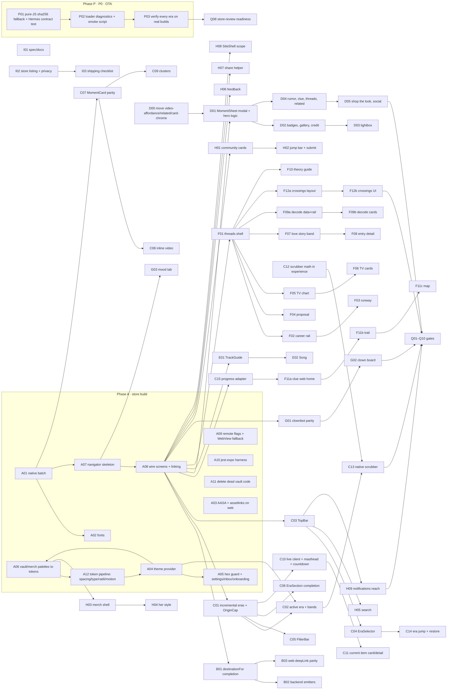

# Native parity completion plan — finishing the React Native port

Owner: Engineering. Status: **draft for founder review, 2026-09-25**. Branch
`plan/native-port`. Builds on `docs/specs/2026-09-05-one-source-three-surfaces.md`
(D1–D4, ratified) and does not reopen any of its decisions. Cards here use the
prefix `NP-` (native parity); `OS-` ids refer to the ratified spec.

> **What changed since the spec.** Every Phase 3 card (OS-030 → OS-039) landed
> between 2026-09-05 and 09-06 (PRs #3841, #3864–#3872). Since OS-039 the
> app's default surface is native: `apps/mobile/App.tsx` mounts a five-tab
> `BottomTabBar` (Eras · Threads · Clownbot · Community · Merch), every
> `DEFAULT_ROUTE_FLAGS` entry is `true`, and `SiteShell` (the WebView) only
> ever renders `/privacy`, `/terms`, `/support`. iOS build 13 / Android
> versionCode 14 (commit `d6bc176a`, 2026-09-16) already ship this. So this is
> **not** a WebView → native port. It is the gap between the thin native
> screens that shipped in one day and the 20k-line web experience they stand in
> for, plus the navigation, theming, deep-link and quality work that makes the
> app pass App Review 4.2 / Play WebView policy on its merits.
>
> **Re-checked at `9bc40534` (PR #4570, iOS build 14 / Android build 15).**
> #4570 added `HomeTopBar` (a "⚙ Settings" pill above the tabs), a Settings
> "About" section with Privacy/Terms/Support, `LegalPageScreen` (WebView + Done),
> a Clownbot AI disclosure and the Settings → Inbox fix (`lib/visible-screen.ts`).
> Two founder requirements were added on 2026-09-25 and are now first-class in
> this plan: **(1) the app must look like the website, rebuilt natively** —
> §4.11 visual-fidelity contract, §4.12 native-vs-web decision table, gate
> NP-Q01 fails on visible divergence; **(2) era content does not load on
> device** — root cause in §1.3 X0, fixed by Phase P (P0, gates the next store
> submission).

---

## 1. Summary and scope

### 1.1 What "native" means here

A screen is **native** when it is a React Native view rendering a view-model
from `@swift2/experience` (or a mobile `lib/*-data.ts` loader over the
published content bundle from `@swift2/content`), themed from the shared
tokens, reachable from the app's own chrome, and covered by the deep-link
contract test. A `WebView` **inside** a native screen for third-party media
(YouTube / Spotify / Instagram embeds in a moment) still counts as native —
the web does exactly the same with iframes.

### 1.2 What stays WebView

Only the three legal pages (`/privacy`, `/terms`, `/support`), rendered by
`apps/mobile/components/SiteShell.tsx`, per OS-039. Whether even those stay is
decided by gate NP-Q10 (§6) using the criteria written there; the default
recommendation is **keep** (static legal copy, `apps/web/lib/longlive/legal.ts`
is 821 lines of counsel-reviewed text, zero product value in re-rendering it).

### 1.3 Where the native app is today (audit 2026-09-25 at `bf902812`, re-checked at `9bc40534`)

Cross-cutting defects, each of which blocks a real user before any per-screen
parity matters:

| # | Defect | Where |
| --- | --- | --- |
| **X0** | **Era content does not load on device — every era shows "Couldn't load this era: No crypto.subtle available in this runtime…".** Root cause: `packages/content/src/hash.ts:9-12` verifies each bundle file's sha256 with WebCrypto `globalThis.crypto.subtle.digest` and throws when it is absent. Hermes (RN 0.86.2) has no WebCrypto; Expo SDK 57's runtime polyfills (`expo/src/winter/*`: `TextDecoder`, `URL`, `fetch`, `FormData`…) add no `crypto.subtle`; neither `expo-crypto` nor `expo-standard-web-crypto` is installed (`apps/mobile/package.json`). `load.ts:331` awaits `createHash` for every file, so `loadBundle` rejects before any file is stored — it is not a `TransportError`, so the last-good fallback never engages (`load.ts:25-27`). Every bundle consumer fails the same way: `era-stream-data.ts`, `threads-data.ts`, `merch-data.ts`, `search-data.ts`, `track-guide-data.ts`. **Evidence (2026-09-25):** production `current.json` → `0dd12fc3…`, `manifest.json` (21 files, schemaVersion 1) and `eras/folklore.json` (94,076 bytes, sha256 `da9189a5…`) all match, so the server side is healthy; running `loadBundle({ baseUrl: 'https://www.longlivets.com/content' })` under node succeeds (`source=network`, 21 files, 35 folklore items) and, with `crypto.subtle` removed to mimic Hermes, fails with exactly the on-device message. `apps/mobile/lib/device-id.ts:16-19` already carries a "Hermes crypto global isn't present" fallback — the same knowledge never reached the loader. **Fix is JS-only (pure-JS SHA-256 fallback in `hash.ts`) → ships by OTA through `publish_update_both`; no store build.** The stores will reject an app whose main tab shows an error on every section, so Phase P gates the next submission. | `packages/content/src/hash.ts:9-12`, `load.ts:327-343`; `apps/mobile/components/EraSection.tsx:31-41, 70-74` |
| X1 | **No back stack.** Navigation is a nested ternary over `useState` booleans (`visibleScreen()` orders the overlays since #4570). `SongScreen` and `TrackGuideScreen` have no close prop; iOS users are stranded, Android hardware back exits the app (the only `BackHandler`s are inside `SiteShell.tsx:115-125` and `LegalPageScreen.tsx:17-24`). | `apps/mobile/App.tsx:86-131, 312-411`; `lib/visible-screen.ts` |
| X2 | **Settings reachable only through a generic pill; no bell; onboarding gated behind it.** #4570 added `HomeTopBar` ("Long Live" + "⚙ Settings" pill, `HomeTopBar.tsx:9-27`) above the tabs, routed through `lib/settings-entry.ts` (onboarding first, then settings). That makes Settings/Inbox/Onboarding reachable, but it is a new UI the website does not have — the web's pattern is the `TopBar` bell (`apps/web/components/longlive/TopBar.tsx:120-133`). `requestPushRegistration()` still has one caller (`OnboardingScreen.tsx:44`); a user who never taps the pill is never asked for push permission. | `App.tsx:266-273, 388`; `components/HomeTopBar.tsx` |
| X3 | ~~Settings → "Inbox" does nothing~~ — **fixed in #4570** (`lib/visible-screen.ts` puts inbox above settings). Kept for the record; NP-A07 replaces the whole mechanism with a stack. | `lib/visible-screen.ts:24-31` |
| X4 | **Kill-switch flags are inert.** A flag set `false` makes `resolve()` return `{web}` and `openWebUrl` sends every non-legal URL to the Eras tab — the D3 WebView fallback no longer exists. Flags are compile-time (`createNavigate` gets no `getFlags`). | `App.tsx:218-234`, `lib/routes.ts:114-125` |
| X5 | **Web share links land on the front door.** `destinationFor` handles `?screen=`/`?mode=threads\|community\|merch`/`?item=` only; `?song=`, `?guide=`, `?theories=`, `?lens=`, `?era=`, `?mode=mood\|clownbot`, `?current=<x>`, `#merch-new-drops` all degrade to the Eras tab. | `packages/shared/src/notification-deep-links.ts:151-202` |
| X6 | **Deep links only work from push taps.** `app.json` declares `scheme: "longlive"` but nothing reads `Linking.getInitialURL` or listens for `url`; no universal links (`associatedDomains` / `intentFilters`). | `App.tsx:259-273`, `app.json:7` |
| X7 | Opening a moment/song/guide unmounts the tab tree; the era stream refetches and lands at the top on return. | `App.tsx:342-383` |
| X8 | **Era re-skin is partial; the app does not look like the site.** `lib/theme.ts` is a static copy of the default (TTPD) palette; only `EraSection` background/hero text and `MomentSheet` bg/ink/accent read `era.theme`. 75 hard-coded hex literals across Settings (26), Inbox (11), Onboarding (10), SiteShell (9), CadencePills (5), SettingsAboutSection (5, #4570), LegalPageScreen (2, #4570), dead code (7). No web fonts (Playfair/Inter/Special Elite/Dancing Script/Bodoni), no gradients, no haptics, no `expo-image`; cards, chrome and spacing are ad hoc rather than the web's `.era-card`/`.era-chip`/`.era-icon-btn` vocabulary (`apps/web/app/globals.css:177-299`). | `apps/mobile/lib/theme.ts:11-21`; `components/HomeTopBar.tsx:30-49` |
| X9 | Taps that do nothing although the target exists: doorways (`EraSection.tsx:129-134`), thread moments (`ThreadsScreen.tsx:150`), search hit on an era (`EraStreamScreen.tsx:45`). Track guide has **no UI entry point** (no `TrackGuideBar`). | — |
| X10 | `OnboardingScreen.tsx:58` renders the literal text `—`. | — |

Per-screen depth is in §2. Dead code: `VaultNavigator.tsx`, `EraTimeline.tsx`,
`lib/vault.ts`, `lib/vault-bundle-map.ts` (+ tests) are unmounted and on the
retired `VaultSkeleton` model.

### 1.4 Non-goals

- Redesign. The web is the reference; where web and native disagree, native
  moves. (Two intentional native-only extras exist — richer notification
  settings and an era-album Spotify embed on every moment; §7 asks Joey which
  to keep.)
- Accounts / sign-in. Identity stays the anonymous device id.
- Content authoring, Karen/CIE, merch or social pipelines — untouched.
- Tablet layouts beyond "does not break" (`supportsTablet: true` stays; iPad
  screenshots are a store task, not a layout project).
- Porting server-only code (`clown-*`, `mood-*` on the server side) — the app
  keeps calling `apps/web/app/api/**`.
- A light theme. The web is dark-only (`color-scheme: dark`).

---

## 2. Inventory

Status legend: **native** = shipped, at parity · **partial** = native screen
exists, missing listed features · **absent** = no native equivalent ·
**WebView** = served by `SiteShell`. Web line counts are the reference
components in `apps/web/components/longlive/**` (W/) and `apps/web/lib/longlive/**`.

### 2.1 Surfaces

| Surface (web entry) | Web reference | Native today | Status | Target | Spec card | Plan cards |
| --- | --- | --- | --- | --- | --- | --- |
| App shell, nav store, back/dismiss (`LongLive.tsx`, `lib/store/*`, `useBackDismiss`) | 111 + 1,176 + 93 | `App.tsx` ternary, no stack | partial | react-navigation stack + tabs, gesture/hardware back, tabs stay mounted | OS-030 | NP-A07, A08 |
| Bottom nav (`BottomNav.tsx`, 6 tabs, icons, hide-while-typing) | 141 + 92 | `BottomTabBar.tsx` 5 text tabs | partial | 6 tabs incl. Mood, icons, keyboard-hide | OS-039 | NP-A07, G03 |
| Top bar (`TopBar.tsx`: wordmark, era label + Now pulse, bell, search, share, scrubber host) | 345 | static title + 2 text buttons (`EraStreamScreen.tsx:60-81`) | partial | full chrome on every tab | OS-032 | NP-C03 |
| Era selector sheet (`EraSelector`, `EraGrid`) | 143 | absent | absent | themed grid sheet | OS-032 | NP-C04 |
| Timeline scrubber (`TimelineScrubber.tsx` + `timelineScrubberLayout.ts`) | 789 + 259 | `EraTimeline.tsx` unmounted, wrong model | absent | native scrubber on shared math | OS-032 | NP-C12, C13 |
| Era stream (`EraStream.tsx`: infinite backwards append, active-era tracking, bands, restore, jump loop, OriginCap) | 470 | 3 fixed eras in a ScrollView (`EraStreamScreen.tsx:29`) | partial | full | OS-032 | NP-C01, C02, C14 |
| Countdown banner (`CountdownBanner.tsx`) | 124 | absent | absent | sticky banner | — | NP-C10 |
| Landing masthead (live activity line, tappable gloss) | 76 | static (`LandingMasthead.tsx:30-33`) | partial | full | OS-032 | NP-C10 |
| Global filter bar (`FilterBar.tsx`, `filters.ts`) | 164 | absent; filters hard-coded empty (`era-stream-data.ts:90`) | absent | sticky 6-chip bar wired to view-model | OS-032 | NP-C05 |
| Era section (`EraSection.tsx`: hero art, era chip, TrackGuideBar, EraSecretCard, feed, threads pivot) | 301 + 218 | text hero + feed (`EraSection.tsx` 181) | partial | full | OS-032 | NP-C06 |
| Moment card (`MomentCard`, `MomentCardButton`, `card-chrome.ts`) | 559 | image + text (`MomentCard.tsx` 155) | partial | meta row, tags, focal point, tiers, suppression | OS-032 | NP-C07 |
| Inline video (`MomentVideo` VideoPoster, `VideoMomentCard`) | 298 | dashed placeholder row (`MomentCard.tsx:70-89`) | absent | poster + inline WebView play | OS-032 | NP-C08 |
| Cluster card (`ClusterCard.tsx`) | 99 | flattened | partial | expand/collapse | OS-032 | NP-C09 |
| Live layer (`CurrentItemCard/Detail`, `use-live-data.ts`, `/vault/live/[eraId]`) | 246 + 51 | absent (`era-stream-data.ts:12-22`) | absent | live cards + verify intake | — | NP-C10, C11 |
| Doorway card (`DoorwayCard.tsx`) | 145 | renders, not tappable | partial | icon, date, opens thread / theory guide with return point | OS-032 | NP-C06, F10 |
| Progress (seen dots, favorites, trails — `progress.ts`) | 205 | absent | absent | storage adapter + wiring | OS-025 | NP-C15 |
| Moment detail (`MomentDetail.tsx`, `ZoomableImage`, `MomentSocialPost`) | 1,205 + 493 | `MomentSheet.tsx` 468 (~35 %) | partial | full, as modal stack screen | OS-033 | NP-D00–D05 |
| Track guide (`TrackGuide.tsx`, `OverlayNav`) | 220 + 112 | `TrackGuideScreen.tsx` 210, no close, no entry point, no loading state | partial | full | OS-035 | NP-E01 |
| Song page (`TrackDetail.tsx`) | 582 | `SongScreen.tsx` 504, no close, no swipe, no hero, no video | partial | full | OS-035 | NP-E02 |
| Theory guide (`TheoryGuide`, `TheoryCard`, `LiveTheoryCard`) | 469 | absent | absent | screen + live strip | — | NP-F10 |
| Threads gallery + detail shell (`ThreadsMode.tsx`) | 432 | `ThreadsScreen.tsx` 269, plain text cards, moment tap no-op | partial | hero tiles, credits, vault palette, taps | OS-034 | NP-F01 |
| Career rail (`ThreadsTimeline.tsx`, fashion only) | 467 | absent | absent | native rail | OS-034 | NP-F02 |
| Runway thread (`runway/RunwayThread.tsx`) | 151 | generic moment list | partial | per-era rooms | OS-034 | NP-F03 |
| Proposal thread (`proposal/ProposalThread.tsx`) | 144 | generic | partial | beat cards | OS-034 | NP-F04 |
| Taylor's Version thread (`taylors-version/*`) | 844 | generic | partial | ownership chart, album cards, compare | OS-034 | NP-F05, F06 |
| Love story thread (`love-story/*`) | 632 | generic | partial | band + scrub layer + EntryDetail | OS-034 | NP-F07, F08 |
| Decode thread (`decode/*`) | 724 | generic | partial | sort/filter, pattern rail, cards | OS-034 | NP-F09a, F09b |
| Clue Web (`ClueWeb.tsx`) | 910 | absent | absent | home / trail / map | OS-034 | NP-F11a–c |
| Crossings (`Crossings.tsx`, `crossingMarkerLayout.ts`) | 619 + 58 | absent | absent | two-lane overlay | OS-034 | NP-F12a, F12b |
| Clownbot chat (`ClownChat*`, `ClownBoard`, `ClownItemCard`) | 1,025 | `ClownChatScreen.tsx` 365: no trail, no starters, no board | partial | full | OS-036 | NP-G01, G02 |
| Mood chat (`MoodChat`, `MoodSongCard`) | 340 | folded into Clownbot toggle, no starters, no play facade | partial | own tab, full | OS-036 | NP-G03 |
| Community (`CommunitySection`, `CommunityCard`, `SectionJumpBar`, `SubmitLinkForm`) | 802 | `CommunityScreen.tsx` 137: cards don't link out | partial | full incl. submit | OS-037 | NP-H01, H02 |
| Merch (`MerchSection`, `merch/*`, `merch-filters.ts`, `shop.ts`) | ~1,400 | `MerchScreen.tsx` 179: 3 flat sections, inert affiliate | partial | full incl. Her Style filters + FTC disclosure | OS-037 | NP-H03, H04 |
| Search (`SearchOverlay.tsx`, `search.ts`) | 441 + 181 | `SearchScreen.tsx` 156: eras + moments only, Eras tab only | partial | all doc types, grouped, every tab | OS-038 | NP-H05 |
| Share (`share-*.ts`, `share-copy.ts`, toast) | 204 | per-screen ad hoc, one hard-coded URL | partial | one helper, every screen | OS-038 | NP-H07 |
| Feedback (`FeedbackButton.tsx`) | 330 | 165, Eras tab only, static location | partial | global, rich location | OS-038 | NP-H06 |
| **Home top bar (#4570 `HomeTopBar.tsx`, 49)** | web has no such bar — the `TopBar` bell is the entry (`TopBar.tsx:120-133`) | "Long Live" wordmark + "⚙ Settings" outlined pill in the default palette | native, **off-web** | **removed**; its job moves into the web-pattern `TopBar` (wordmark → home, era label, bell, search, share); `lib/settings-entry.ts` gate is kept and called by the bell | — | NP-C03 |
| Notification settings (`WebNotificationSettings`) + About section (#4570 `SettingsAboutSection.tsx`) | 293 | `NotificationSettingsScreen.tsx` 478 — **ahead of web**; About rows use 5 hex literals | native (reachable via the pill since #4570) | reachable from the bell, tokens, `Switch`, About restyled to the web's settings-row vocabulary | Notifications spec | NP-A05, C03, H09 |
| Notification inbox | none on web | 153, reachable Settings → Inbox since #4570 | native | tokens, labels, read state | Notifications spec | NP-A05, A08, H09 |
| Onboarding / push permission | none on web | 117, reachable via the pill gate since #4570, `—` bug | native | reachable at first bell tap, "Not now" | Notifications spec | NP-A05, H09 |
| Privacy / Terms / Support (host: #4570 `LegalPageScreen.tsx`, 53) | 3 routes; web footer links | `LegalPageScreen` = WebView + "Done" row in hex colours; also opened from the Clownbot AI disclosure (`ClownChatScreen.tsx:263`) | WebView | WebView (gate NP-Q10) hosted in `WebScreen` with the web-pattern `OverlayNav` header (wordmark, title, 44 px close) | OS-039 | NP-A09, H08, Q10 |
| Route flags / kill switch (`lib/routes.ts`) | — | compile-time constants, fallback broken (X4) | partial | remote JSON, WebView fallback restored | OS-030 | NP-A09 |
| Deep links (scheme, universal links, `destinationFor`) | `deepLink.ts` | push-tap only (X5, X6) | partial | every web param + backend URL + OS links | OS-003, OS-030 | NP-A08, B01–B03 |
| Internal notifications dashboard (`/internal/notifications`) | 195 | — | n/a | never native (ops page) | — | — |

### 2.2 Remaining `OS-` spec cards

| Card | State in code | Left to do |
| --- | --- | --- |
| OS-030 … OS-038 | merged (#3841, #3864–#3871) but the spec carries no **Done** markers | mark Done in spec (NP-I01); depth gaps above |
| OS-039 | merged (#3872) | "refresh store screenshots natively; update App Privacy answers" not done — `apps/mobile/docs/store-listing.md:138-141` and `privacy-and-data-safety.md` still describe the in-app site (NP-I02) |
| OS-004 | HA #43 steps 1–3 done; step 4 (real-device push → deep link) open | human; re-verify after NP-A08 (gate NP-Q09) |
| OS-042 | done | inventory rows "Usage Data (Vercel Analytics inside the in-app site)" now false for a native-only app — regenerate (NP-I02) |
| OS-026 goldens | done | extend with scrubber math + new view-models as cards add them (NP-C12, F05, F07) |
| OS-041, OS-043, OS-044 | done | none |

---

## 3. Phases, milestones, release mechanics

### 3.1 The one store build

Every native-module change alters the fingerprint and forces store builds on
both platforms (`docs/mobile-release.md` "Fingerprint decides"). This plan
needs exactly **one** such change, batched into Phase A on an integration
branch so the train produces one build pair, not six:

| Module | Why | Card |
| --- | --- | --- |
| `react-native-screens`, `@react-navigation/native`, `@react-navigation/native-stack`, `@react-navigation/bottom-tabs` | real stack, modal sheets, gesture/hardware back, `linking` config (X1, X6, X7) | NP-A01 |
| `expo-linear-gradient` | era hero fades, inter-era bands, scrim on hero cards | NP-A01 |
| `expo-image` | focal-point crops, caching, blurhash placeholders in the feed | NP-A01 |
| `expo-haptics` | scrubber detents, toggles | NP-A01 |
| `expo-font` (config plugin, bundled TTFs) | `--era-font` parity: Playfair, Inter, Special Elite, Dancing Script, Bodoni Moda | NP-A02 |
| `react-native-svg` | scrubber activity ridge, ownership timeline, Clue Web constellation, Crossings lanes | NP-A01 |
| `app.json` `ios.associatedDomains`, `android.intentFilters` | universal links | NP-A01 |

Everything after Phase A is JS + assets and ships by OTA through
`publish_update_both`. A card that adds *any* dependency must show the
fingerprint hash unchanged (§5.9) or be moved into Phase A.

Phase A's PR body must say, per `docs/mobile-release.md:169-171`: "native
dependency change — the train builds both platforms; users get it after store
review." Bump `apps/mobile/app.json` `version` to `1.1.0` in that PR.

### 3.2 Phases

| Phase | Milestone (shippable state) | Ships by |
| --- | --- | --- |
| **P — Era content unblock (P0, first)** | Every era's content loads on real iOS and Android builds; a regression test pins the Hermes runtime contract; a smoke script proves the production bundle loads without WebCrypto. **Gates the next store submission** — reviewers will reject an app whose main tab errors on every section. | **OTA** (JS-only fix in `packages/content`) |
| **A — Foundation** | Real navigation with back everywhere; every existing screen reachable (bell, TrackGuideBar comes in C06); per-era theme provider fed by the shared token pipeline; no hex literals; remote flags with WebView fallback; component test harness; dead code gone; fonts/gradients/haptics available | one store build (integration branch `feat/np-native-batch`) |
| **B — Deep-link contract** | Every URL the web can share and every URL the backend emits opens the right native screen; scheme + universal links work; web itself honours `?current=`/`#merch-new-drops` | OTA (+ web deploy) |
| **C — Era stream (front door)** | Stream at parity: chrome, selector, filters, section, cards, video, clusters, live layer, scrubber, progress | OTA, card by card |
| **D — Moment detail** | `MomentDetail` parity as a modal | OTA |
| **E — Track guide + song** | parity incl. swipe | OTA |
| **F — Threads** | gallery, six thread kinds, Clue Web, Crossings, theory guide | OTA |
| **G — Clownbot + Mood** | parity; Mood tab | OTA |
| **H — Community, Merch, Search, Share, Feedback, Legal, Notifications reach** | parity | OTA (+ one web/API change for submit-link) |
| **I — Docs, spec, store assets** | spec/architecture/README current; store listing + screenshots native; privacy inventory true | docs / store console |
| **Q — Quality gates** | ten pass/fail gates (§6) | — |

**Store-review-critical subset (P0)** if Joey wants the fastest defensible
4.2 story: **Phase P first (P01–P03, before anything else)**, then all of A,
A12, B01, C01–C08, C13, D00–D02, E01–E02, F01, G01, H01, H03, H05, H09, I02,
then gates Q01–Q10. Everything else is parity polish that can follow by OTA
after submission.

### 3.3 Dependency graph



---

## 4. Shared conventions (every card follows these)

### 4.1 Directory layout (`apps/mobile`)

```
App.tsx                      providers + <RootNavigator/> only (target ≤ 80 lines)
navigation/
  RootNavigator.tsx          native-stack: Tabs + modal/detail screens
  TabsNavigator.tsx          bottom-tabs: Eras · Threads · Mood · Clownbot · Community · Merch
  linking.ts                 react-navigation `linking` config built on lib/routes.ts
  types.ts                   RootStackParamList, TabParamList (single source of route names)
screens/                     one file per navigator route, `<Name>Screen.tsx`, ≤ 300 lines
components/
  chrome/                    TopBar, BottomTabBar, EraSelectorSheet, FilterBar, OverlayNav
  era-stream/                EraSection, MomentCard, VideoPoster, ClusterCard, DoorwayCard, …
  moment/                    MomentHero, MomentBadges, MomentGallery, Lightbox, …
  threads/<thread-id>/       one dir per thread kind
  clown/, mood/, community/, merch/, search/, notifications/
  ui/                        primitives: Text (themed), Pressable44, Chip, Badge, Sheet, Skeleton
lib/
  theme/                     era-theme.ts, ThemeProvider.tsx, use-theme.ts, fonts.ts, spacing.ts
  *-data.ts                  bundle loaders + provider wiring (existing pattern: ensureXWired)
  routes.ts, route-flags.ts  resolve(), flags
  share.ts, haptics.ts, live-client.ts, progress-storage.ts
__tests__/                   *.test.tsx render tests (jest-expo); *.test.ts stay in vitest
assets/fonts/                bundled TTFs (OFL), listed in app.json expo-font plugin
```

Existing files move into this layout **only** by the card that next touches
them (no big-bang move PR). Files stay ≤ 300 lines (CLAUDE.md Mechanics);
split and record in `MAP.md`.

### 4.2 Naming

Screens `XxxScreen`, modal detail `XxxSheet` only when presented as
`presentation: 'modal' | 'formSheet'`. Pure view-model builders live in
`packages/experience/src/<domain>.ts` and are named `build<Thing>ViewModel` /
`<verb><Noun>`; RN components never compute what the web computes in `lib/`.
Data loaders are `load<Thing>(…)` in `apps/mobile/lib/<thing>-data.ts`.
Test ids: `testID="ll-<screen>-<element>"`.

### 4.3 Theming — era re-skin

- **Source of truth:** `packages/experience/src/tokens.ts` (+ `ERAS[i].theme`
  in `eras.ts`). Card NP-A06 moves `VAULT_THEME`, `MERCH_THEME`, `accentFgFor`
  from `apps/web/lib/longlive/theme.ts:17-49,76-78` into tokens so both
  renderers import them.
- **One pipeline, two outputs (the design-token contract):**
  `packages/experience/src/tokens.ts` → `scripts/generate-design-tokens.mjs` →
  `apps/web/app/tokens.generated.css` (web, checked by `check:generated`) and,
  on native, the same module imported directly by `useTheme()`. OS-031 built
  this for colours only; NP-A12 extends `tokens.ts` with `SPACING`, `TYPE`
  (size/line-height/weight/tracking), `RADII`, `MOTION` (durations/easings)
  and `CHROME` (top-bar height, tab-bar height, hit target 44), emits them as
  `--ll-*` CSS variables, and snapshot-tests that the web's `globals.css`
  component classes (`.era-card`, `.era-chip`, `.era-icon-btn`, `.ll-filter-chip`)
  resolve to those values. Native never declares a scale of its own.
- **Provider:** `lib/theme/ThemeProvider.tsx` exposes
  `useTheme(): { colors: Palette; font: FontFamily; radii; spacing; type }`.
  `Palette` mirrors `EraTheme` (`bg, surface, surface2, ink, inkSoft, line,
  accent, accent2, glow, accentText, accentFg`). Scopes: the active era on the
  Eras tab (follows viewport centre, NP-C02), the moment's/track's own era in
  detail screens, `VAULT_THEME` on Threads, `MERCH_THEME` on Merch,
  `CLOWN_TOKENS` on Clownbot/Mood. Nest `<ThemeScope theme={…}>` to re-skin a
  subtree (the web nests `themeStyle()` per `EraSection`).
- **Rule:** no hex literal outside `lib/theme/**`. Enforced by
  `apps/mobile/lib/theme/no-hex-literals.test.ts` (NP-A05). `color-mix`
  equivalents come from `lib/theme/mix.ts` (`mix(hex, pct)` → rgba).
- **Anything painted on a solid accent uses `accentFg`**, never white
  (web tests `accent-fill-foreground.test.ts` — WCAG AA).
- **Fonts:** `theme.font` → `fontFamily` per `EraTheme.font`
  (`serif`→PlayfairDisplay, `sans`→Inter, `mono`→SpecialElite,
  `script`→DancingScript; merch → BodoniModa). Titles use `font-era`; body
  stays Inter, as on web.
- **Spacing scale** 4/8/12/16/24/32/48; **type scale** 12/14/16/18/22/28/36
  with `maxFontSizeMultiplier={1.6}`; **radii** 8/12/16/999; **hit target ≥ 44**.
- **Motion:** 700 ms bg/ink cross-fade on era change (`.era-shell`), 320 ms
  scale-in for detail (`detail-enter`), staggered 40 ms `era-enter` on grids;
  all gated by `AccessibilityInfo.isReduceMotionEnabled()` via
  `useReducedMotion()` in `lib/theme/motion.ts`.

### 4.4 Navigation

- Library: `@react-navigation/native` 7 + `native-stack` + `bottom-tabs`
  (decision: reversible, made here; alternative `expo-router` rejected as a
  file-system re-layout the web's URL-driven store does not need).
- Root: `NativeStack { Tabs, Moment(modal), TrackGuide, Song, TheoryGuide,
  Crossings, ClueWeb, Search(modal), Settings, Inbox, Onboarding(modal),
  Legal(WebView) }`. Tabs stay mounted under stack screens (fixes X7).
- **Every external URL still goes through `navigate(url)`**
  (`lib/routes.ts` `createNavigate`) — push taps, inbox rows, OS links,
  in-app "open web link" fallbacks. Internal taps use typed
  `navigation.navigate('Song', { eraId, trackKey })`. Param types live only
  in `navigation/types.ts`.
- Back: never implement your own; `navigation.goBack()`; hardware back and
  swipe are the navigator's. A screen with internal sub-state (Clue Web
  views, thread detail) uses `usePreventRemove` / `BackHandler` only through
  `lib/navigation/use-back-guard.ts` (one helper, NP-A08).
- Deep links: `navigation/linking.ts` `getStateFromPath(path)` calls
  `resolve(SITE_URL + path)` and maps `{native, params}` to a stack state;
  prefixes `longlive://`, `https://www.longlivets.com`, `https://longlivets.com`.

### 4.5 State and data

- Content: `@swift2/content` `loadBundle` through the existing
  `apps/mobile/lib/*-data.ts` loaders (`ensureTrackGuideWired`,
  `ensureThreadContent`, `loadEraStream`). New pure logic → `packages/experience`
  (purity guard: no `react-native`, `next`, `react-dom`, `window`, `document`).
  Anything currently in `apps/web/lib/longlive/*.ts` that a native card needs
  is **moved** to `packages/experience` first (web re-imports), never copied.
- Live data: `lib/live-client.ts` (NP-C10) is the only caller of
  `/vault/live/<eraId>`; 15-min server cache, no client polling (same as web).
- Persistence: `@swift2/experience` `StorageAdapter` implemented over
  `expo-file-system` (`lib/progress-storage.ts`), keys identical to web
  (`ll-progress-v1`) so copy stays portable.
- API calls use `EXPO_PUBLIC_API_BASE_URL` (existing clients); `SITE_URL`
  only for share links and the legal WebView.

### 4.6 Testing

- Pure logic: vitest, colocated `*.test.ts` (already in root config for
  `apps/mobile/**` and `packages/**`). Goldens in
  `packages/experience/test/golden/conformance.test.ts` get a new snapshot
  whenever a card adds a view-model.
- Components: `jest-expo` + `@testing-library/react-native` (NP-A10),
  `apps/mobile/__tests__/**/*.test.tsx`, run by `npm run test:mobile`. Every
  screen card adds one render test: renders from a fixture view-model, asserts
  key text/roles, fires the primary press. (If NP-A10 is blocked — see risks —
  cards substitute a device screenshot pair in the PR; the gate NP-Q06 then
  requires the harness before sign-off.)
- Device: each UI card's PR carries **one iOS simulator + one Android
  emulator screenshot** of the changed state (`npx expo start`, Expo Go is
  fine until Phase A's build exists; after that, the EAS `development`
  profile build). CLAUDE.md: "a green suite is not evidence."
- Contract: `packages/shared/src/notification-deep-links.test.ts` +
  `apps/mobile/lib/routes.test.ts` must both enumerate every URL pattern; a
  new pattern without a test fails review.

### 4.7 Accessibility baseline

Every `Pressable`: `accessibilityRole` + `accessibilityLabel` (+ `state`);
min 44×44; lists announce section headers (`accessibilityRole="header"`);
async results use `accessibilityLiveRegion="polite"` (Android) and
`AccessibilityInfo.announceForAccessibility` (iOS); images carry `alt`
(`expo-image` `accessibilityLabel`) or `accessible={false}` when decorative;
sliders (scrubber) expose `adjustable` with `accessibilityValue`; respect
reduce-motion; dynamic type up to 1.6×; contrast per `accentFg` rule.

### 4.8 Standard DONE block (referenced by cards as "§4.8")

```sh
npm run typecheck --workspace @swift2/mobile                 # exit 0
npx vitest run apps/mobile packages/experience packages/shared packages/content   # green
npm run test:mobile                                           # green (after NP-A10)
cd apps/mobile && npx expo export --platform ios && npx expo export --platform android   # exit 0
```
plus: no new hex literal (`no-hex-literals.test.ts` green), iOS + Android
screenshots in the PR, docs touched in the same PR when behaviour changed
(`MAP.md` for new files, `docs/architecture.md` §mobile for structure), and —
for every card that renders something — **the §4.11 side-by-side pair**: the
native screenshot next to the web reference component the card names, at the
§4.11 device sizes, with the §4.11 checklist ticked in the PR body. A card
whose pair shows a visible divergence is not done.

### 4.9 Fingerprint check (referenced as "§4.9")

```sh
# on main and on your branch, same machine:
npx @expo/fingerprint apps/mobile | node -e "process.stdin.on('data',d=>console.log(JSON.parse(d).hash))"
```
OTA cards: hashes **equal**. Store card (NP-A01/A02 batch): hashes **differ**
and the PR body says so.

### 4.10 Card format

`ID · Title · Size (S ≤ ½ day, M ≤ 1 day, L ≤ 2 days) · OTA | STORE`, then
Goal · Touches · Depends on · Context (file:lines to read — nothing else) ·
Steps · Start when · Done when · Out of scope. Target diff ≤ 400 lines
excluding generated snapshots, fonts and lockfile. Branch `feat/np-<id>`
(Phase A native cards: branch from and PR into `feat/np-native-batch`).

### 4.11 Visual fidelity contract — "mimic the website, natively"

The target look **is** longlivets.com: its layout, typography, era theming,
cards, scrubber, bottom nav and spacing, rebuilt with native components. This
is measurable, not a vibe:

- **Reference capture.** Web: Playwright `mobile-chrome` project
  (`playwright.config.ts`) against `https://www.longlivets.com` at **390×844**
  (iPhone-class) and **412×915** (Pixel-class), plus the URL of the state
  (`?item=`, `?song=`, `?lens=`, `?mode=`). Native: iOS simulator **iPhone 15
  (393×852 @3x)** and Android emulator **Pixel 8 (412×915 @2.625x)**, same
  state reached through the app. Store both in the PR (`docs/audits/` for gates).
- **Checklist (every pair, every card):** ① same block order top-to-bottom;
  ② same type hierarchy — family per `EraTheme.font`, sizes within ±1 pt at
  1× (web `rem` → pt at 16), weights equal; ③ palette — `bg`, `surface`,
  `ink`, `accent` sampled hex within ΔE ≤ 3 of the web pair (`STATUS_TOKENS`
  mixes computed via `mix()`); ④ spacing — paddings/gaps within ±2 pt of the
  web's; radii equal; ⑤ same iconography meaning and placement (glyph set may
  differ: `@expo/vector-icons` Feather vs lucide); ⑥ same copy, same casing
  (Definition of Done §8: era/album capitalisation exactly as Taylor writes
  it); ⑦ same imagery treatment (focal crop, gradient scrim, 16:9 posters,
  16:10 compact photo frames); ⑧ same empty/loading/error copy.
- **What may differ (see §4.12):** transitions, gesture affordances, system
  chrome (status bar, home indicator, keyboard), sheet presentation, scroll
  physics, haptics, and the bottom nav's *component* (native `bottom-tabs`)
  as long as its *look* (labels + icons, era tint, height) matches `BottomNav`.
- **Enforcement:** the §4.8 pair per card; gate NP-Q01 across all 12 eras and
  every surface; `no-hex-literals.test.ts` and NP-A12's token snapshot keep
  drift out structurally.

### 4.12 When "native to iOS/Android" and "mimic the web" conflict

Rule of thumb: **the web wins everything the user sees at rest; the platform
wins everything the user feels.** Specific calls (all reversible; recorded
here so cards do not re-litigate them):

| Area | Decision | Why |
| --- | --- | --- |
| Back navigation | **Native wins.** iOS swipe-back and Android hardware/gesture back through react-navigation; no in-content "← All threads"-style buttons unless the web has them too (it does in threads detail — keep both). | The web fakes this with `history.pushState`; native has the real thing. |
| Top bar | **Web look.** `TopBar` (wordmark, era label + Now pulse, bell, search, share) rendered by us, not a UIKit/Material app bar; no iOS large titles. `HomeTopBar` from #4570 is removed. | The header *is* the product's brand surface on web. |
| Bottom tab bar | **Web look on a native component.** `@react-navigation/bottom-tabs` with a custom `tabBar` that mirrors `BottomNav` (six labelled tabs with icons, era tint, hides while typing, safe-area padded). | Native gets state restoration and a11y; the user sees the web bar. |
| Overlays (moment, track guide, song, search, selector) | **Native presentation, web content.** iOS `formSheet`/`modal` with grabber and swipe-down, Android full-screen `card` with hardware back; inside, the web's layout and chrome (`OverlayNav`/close 44 px top-right). | The web uses fixed-position dialogs; a sheet is the platform's equivalent. |
| Scrubber and rails | **Web look, native feel.** Same rail/pill/ridge visuals; drag via gesture-handler on the UI thread; subtle haptic at milestones (web has none — additive). | Fidelity where seen, platform where touched. |
| Typography | **Web families and sizes**, native dynamic-type scaling capped at 1.6× (`maxFontSizeMultiplier`). | Accessibility must not break the layout; capping is the compromise. |
| Motion | **Web durations/easings from `MOTION` tokens**, honouring the platform reduce-motion setting. | Same feel across surfaces; system preference wins. |
| System UI | **Native.** Status bar tinted to the era `bg`; safe areas; keyboard avoidance; share sheet (`Share.share`); external links open the system browser via `Linking` (no in-app browser dependency). | Platform conventions users expect. |
| Error/empty/offline copy | **Web copy** in native components. | One voice. |
| Legal pages | WebView inside `WebScreen` with the web-pattern `OverlayNav` header (gate Q10). | Static counsel text; the header keeps it inside the brand. |
| Anything not listed | Web look; if it cannot be reproduced with RN primitives, file a card that adds the token/primitive rather than improvising. | Prevents a third visual vocabulary. |

---

## 5. Task cards

### Phase P — Era content unblock (P0; run before everything else; OTA)

> Root cause and evidence: §1.3 X0. All three cards are JS-only (`packages/content`
> + `apps/mobile` diagnostics) and ship as one OTA update group through the
> train. **No store submission until P03 is green.**

#### NP-P01 · Pure-JS SHA-256 fallback in `packages/content` + Hermes runtime-contract test · S · OTA · **P0**
**Goal.** `loadBundle` verifies file integrity on runtimes without WebCrypto (Hermes), so every era's content loads on device.
**Touches.** `packages/content/src/hash.ts` (keep `crypto.subtle` when present; otherwise a dependency-free SHA-256 over the UTF-8 bytes — ~60 lines, FIPS 180-4 straight port; export `sha256Hex(bytes: Uint8Array)`), `packages/content/src/hash.test.ts` (new: for every file in `src/fixtures/bundle/**` and the two production samples recorded in this card's PR, the pure-JS digest equals `node:crypto`'s; plus a test that deletes `globalThis.crypto.subtle` and `loadBundle`s the fixture bundle through an in-memory `fetchImpl` — the exact reproduction from §1.3 X0), `packages/content/src/load.test.ts` (one case: integrity still fails loudly on a tampered file under the fallback), `packages/content/README.md` or the ADR note in `docs/decisions.md` 2026-09-05 "content bundle is an artifact" (one line: WebCrypto optional).
**Depends on.** —
**Context.** `packages/content/src/hash.ts` (whole, 21 lines); `packages/content/src/load.ts:20-30, 320-345`; `packages/content/src/load.test.ts:1-40` (fixture + `fetchImpl` pattern to copy); `apps/mobile/lib/device-id.ts:12-22` (the existing "crypto global may be absent" precedent).
**Steps.** Implement fallback; tests; run `npx vitest run packages/content` — the no-subtle case must fail before the fix and pass after (commit the failing test first so the PR shows red → green).
**Start when.** Nothing pending. Branch `fix/np-p01-bundle-hash-hermes` off `main`.
**Done when.** `npx vitest run packages/content` green incl. the no-subtle case; §4.9 fingerprint hash **equal** to main (JS-only); `npm run typecheck` exit 0; PR body says "JS-only → OTA".
**Out of scope.** Installing `expo-crypto` (native → store build; rejected for this fix); changing the manifest format.

#### NP-P02 · Loader diagnostics, retry, and a production smoke script · S · OTA · **P0**
**Goal.** When the bundle cannot load, the app says why in one line and offers Retry; engineering can prove "the production bundle loads on a Hermes-like runtime" from CI without a device.
**Touches.** `scripts/mobile/check-bundle-load.mjs` (new: fetches `current.json` → manifest → every file from `https://www.longlivets.com/content` through `packages/content`'s `loadBundle` with `globalThis.crypto.subtle` deleted, prints per-file OK/FAIL and item counts per era, exit 1 on any failure; `--base-url` flag), `package.json` (`check:bundle-load`), `.github/workflows/mobile-parity.yml` (run the script after `check-parity.mjs`; failure → the existing DIVERGED/UNCHECKED alert path with a third title "Mobile: content bundle does not load"), `apps/mobile/components/EraSection.tsx:66-76` (error state → short copy "Couldn't load this era." + **Retry** button + the raw message in `accessibilityHint`/dev-only text), `apps/mobile/lib/era-stream-data.ts` (`loadEraStream` clears the module-level memo on failure so Retry refetches), `docs/mobile-release.md` (one paragraph: the bundle-load check and what to do when it fails).
**Depends on.** NP-P01.
**Context.** `packages/content/src/load.ts:65-87, 212-230` (options/result); `scripts/mobile/check-parity.mjs` (exit-code and alert conventions); `.github/workflows/mobile-parity.yml`; `apps/mobile/components/EraSection.tsx:20-45, 66-76`.
**Steps.** Script first (it must fail on `main` before P01 and pass after — attach both outputs to the PR); CI step; UI retry.
**Start when.** P01 merged.
**Done when.** `node scripts/mobile/check-bundle-load.mjs` exit 0 against production, printing 12 eras with item counts > 0; workflow run green; §4.8 typecheck/export; Retry path exercised in a dev build with airplane mode toggled (screenshots: error → retry → content).
**Out of scope.** Offline-first UX beyond the loader's existing last-good fallback (gate Q05).

#### NP-P03 · Verify every era renders on real iOS and Android builds · S · OTA (verification)
**Goal.** Objective proof the fix reached users' runtime, not just node.
**Touches.** `docs/audits/2026-<date>-native-era-content.md` (new: 12 eras × 2 platforms table with screenshots or a checklist row per era, `eas update:view` group id, build numbers), `HUMAN-ACTIONS.md` (only if a founder's device is the only real device available — otherwise none).
**Depends on.** NP-P01, NP-P02 merged and published by the train (`publish_update_both`).
**Context.** `docs/mobile-release.md:16-31` (how the OTA reaches devices), `:116-127` (`eas workflow:runs`, `eas update:view`); `apps/mobile/components/EraStreamScreen.tsx:29` (`INITIAL_ERA_COUNT = 3` — until NP-C01 lands, reach older eras via `?era=`-free means: use the Threads tab and Search to open moments from each era, and note that the stream itself shows only three eras; record this limitation in the audit).
**Steps.** Install the store/TestFlight build (14 / 15) on a physical iPhone and a physical Android phone; cold start; confirm the OTA group is applied (`expo-updates` `Updates.updateId` shown in Settings › About — add that line if missing, S); walk every era's content (stream sections for the three newest; Search → a moment per remaining era); airplane mode → relaunch → content still renders from last-good.
**Start when.** The train's run for P02 shows `publish_update_both` succeeded.
**Done when.** Audit doc committed with all 24 cells green; `node scripts/mobile/check-bundle-load.mjs` exit 0 the same day; `node scripts/mobile/check-parity.mjs` exit 0. **This is the gate for the next store submission** (and a precondition of NP-Q08).
**Out of scope.** Any UI change.

### Phase A — Foundation (one store build; integration branch `feat/np-native-batch`)

#### NP-A01 · Native module batch + universal-link config · M · **STORE**
**Goal.** Install every native dependency the rest of the plan needs in one fingerprint change, and declare universal-link domains.
**Touches.** `apps/mobile/package.json`, `package-lock.json`, `apps/mobile/app.json`, `apps/mobile/babel.config.js` (only if a plugin is required), `apps/mobile/README.md` (new "Native dependencies" section), `packages/experience/package.json` (peerDependencies `react` → `"^18.3.1 || ^19.0.0"`).
**Depends on.** —
**Context.** `apps/mobile/package.json` (whole, 46 lines); `apps/mobile/app.json:1-63`; `docs/mobile-release.md:33-48, 162-180`; `apps/mobile/app-config.test.ts`.
**Steps.**
1. From `apps/mobile`: `npx expo install react-native-screens @react-navigation/native @react-navigation/native-stack @react-navigation/bottom-tabs expo-linear-gradient expo-image expo-haptics react-native-svg expo-font` (SDK 57-compatible versions chosen by `expo install`).
2. `app.json`: add `ios.associatedDomains: ["applinks:www.longlivets.com", "applinks:longlivets.com"]` and `android.intentFilters: [{ action: "VIEW", autoVerify: true, data: [{ scheme: "https", host: "www.longlivets.com" }, { scheme: "https", host: "longlivets.com" }], category: ["BROWSABLE", "DEFAULT"] }]`. Add `"expo-font"` to `plugins` with an empty `fonts` array (NP-A02 fills it).
3. Bump `version` to `"1.1.0"`.
4. Extend `app-config.test.ts`: `associatedDomains` contains both hosts; `intentFilters[0].autoVerify === true`; `platforms` still `["ios","android"]`.
5. Fix the `packages/experience` peer range (npm warns on React 19 today).
6. README section listing each module and the card that first uses it.
**Start when.** Branch `feat/np-native-batch` exists off `main`; you branch off it.
**Done when.** §4.8 typecheck + export pass; `npm ci` at root has no `ERESOLVE`; §4.9 hashes **differ** from main; `app-config.test.ts` green; PR body states "native change → store build".
**Out of scope.** Using any module; navigation code; font files.

#### NP-A02 · Bundle the five web fonts · S · **STORE** (same batch)
**Goal.** The app can render every `EraTheme.font` family the web uses.
**Touches.** `apps/mobile/assets/fonts/*.ttf` (new: Inter Regular/Medium/SemiBold; PlayfairDisplay Regular/SemiBold/Italic; SpecialElite Regular; DancingScript Regular/SemiBold; BodoniModa Regular/SemiBold/ExtraBold/Italic), `apps/mobile/assets/fonts/LICENSES.md` (OFL texts), `apps/mobile/app.json` (`expo-font` plugin `fonts` list), `apps/mobile/lib/theme/fonts.ts` (new: `FONT_FAMILY: Record<EraTheme['font'] | 'merch', { regular: string; semibold: string; italic?: string }>`), `apps/mobile/lib/theme/fonts.test.ts` (new).
**Depends on.** NP-A01.
**Context.** `apps/web/app/layout.tsx:16-39` (families/weights); `apps/web/lib/longlive/theme.ts:4-9` (font key → family); `packages/experience/src/types.ts:202-225` (`EraTheme.font`).
**Steps.** Download static TTFs from Google Fonts; list them in the plugin; write the mapping; test asserts every `EraTheme['font']` value has a mapping and every mapped file exists.
**Start when.** NP-A01 merged into the integration branch.
**Done when.** `fonts.test.ts` green; `npx expo export --platform ios` lists the TTFs under assets; §4.9 differs (expected, same batch); dev-build screenshot of one `Text` per family on both platforms.
**Out of scope.** Applying fonts to screens.

#### NP-A03 · Universal-link association files on the web · S · web deploy
**Goal.** iOS and Android verify `longlivets.com` links for the app.
**Touches.** `apps/web/public/.well-known/apple-app-site-association` (new, JSON, no extension), `apps/web/public/.well-known/assetlinks.json` (new), `apps/web/next.config.*` (`Content-Type: application/json` header for the AASA path), `apps/web/lib/longlive/well-known.test.ts` (new), `HUMAN-ACTIONS.md` (one item: paste the Play App Signing SHA-256 from Play Console → App integrity).
**Depends on.** — (harmless until the app declares domains).
**Context.** `apps/mobile/app.json:19-34` (bundle id / package `ai.jwlabs.longlive`); `apps/mobile/eas.json:41-52` (team `D9N628AFHS`); the headers block in `apps/web/next.config.*`.
**Steps.** AASA `appID "D9N628AFHS.ai.jwlabs.longlive"`, paths `["/", "/?*"]`; assetlinks with placeholder `SHA256_FINGERPRINT_PENDING`; test parses both, asserts ids, skips the fingerprint check while the placeholder is present (prints a warning); file the HUMAN-ACTIONS item.
**Start when.** Nothing pending.
**Done when.** `npx vitest run apps/web/lib/longlive/well-known` green; after deploy `curl -sI https://www.longlivets.com/.well-known/apple-app-site-association` shows a JSON content-type; HUMAN-ACTIONS item filed.
**Out of scope.** App-side handling (NP-A08).

#### NP-A04 · Theme provider, palettes, spacing/type scales · M · OTA
**Goal.** One `useTheme()` every screen reads; era palettes come from `ERAS[i].theme`.
**Touches.** `apps/mobile/lib/theme/era-theme.ts` (new: `Palette`, `paletteFromEraTheme(t: EraTheme): Palette`, `DEFAULT_PALETTE` from `ERA_TOKENS`), `lib/theme/ThemeProvider.tsx` (new: `ThemeProvider`, `ThemeScope`, `useTheme`), `lib/theme/mix.ts` (new: `mix(hex, pct)` → rgba), `lib/theme/scales.ts` (new: `SPACING`, `TYPE`, `RADII`), `lib/theme/motion.ts` (new: `useReducedMotion`), `lib/theme.ts` (re-export shim, `@deprecated`; deleted in NP-A05), tests `era-theme.test.ts`, `mix.test.ts`, `apps/mobile/App.tsx` (wrap in provider).
**Depends on.** NP-A02 (fonts map) — start in parallel, wire fonts last; NP-A12 (scales come from tokens — until it lands, `scales.ts` may hold the measured values with a `TODO(NP-A12)`).
**Context.** `apps/mobile/lib/theme.ts:1-60`; `packages/experience/src/tokens.ts:19-63`; `packages/experience/src/eras.ts:10-60, 342-352`; `apps/web/lib/longlive/theme.ts:55-96` (`eraStyle`/`themeStyle` — the contract mirrored); `apps/web/app/globals.css:59-66, 215-222`; §4.11–4.12 of this plan.
**Steps.**
1. `paletteFromEraTheme` maps every `EraTheme` key 1:1; `accentFg` defaults to `#000` (web `--era-accent-fg`); `accentText` falls back to `accent`.
2. `ThemeProvider` holds `{ palette, font }`; `ThemeScope` overrides a subtree; `useTheme()` returns `{ colors, font, fontFamily: FONT_FAMILY[font], spacing, type, radii }`.
3. `mix(hex, pct)` reproduces `color-mix(in srgb, <hex> <pct>%, transparent)`; test against `STATUS_TOKENS` values.
4. Test: for each of the 12 `ERAS`, palette has 11 keys, all valid colours.
**Start when.** NP-A02 merged (or stub `FONT_FAMILY` until then).
**Done when.** §4.8; `era-theme.test.ts` iterates all `ERAS`; §4.9 equal to main.
**Out of scope.** Migrating screens (A05 and each screen card).

#### NP-A05 · Hex-literal guard + migrate notification screens to tokens · M · OTA
**Goal.** No hard-coded colours in shipped components; Settings/Inbox/Onboarding/CadencePills read `useTheme()`.
**Touches.** `apps/mobile/lib/theme/no-hex-literals.test.ts` (new: globs `apps/mobile/{components,screens,navigation}/**/*.tsx`, fails on `/#[0-9a-fA-F]{3,8}\b/` outside `lib/theme/**`, allowlist `lib/theme/hex-allowlist.json`), `components/NotificationSettingsScreen.tsx`, `components/NotificationInboxScreen.tsx`, `components/OnboardingScreen.tsx`, `components/CadencePills.tsx`, delete `lib/theme.ts` shim.
**Depends on.** NP-A04.
**Context.** the four components (whole); `lib/theme/ThemeProvider.tsx`; `apps/web/components/longlive/WebNotificationSettings.tsx:36-62` (cadence visual reference).
**Steps.** Replace literals with palette keys; Settings custom toggle (`NotificationSettingsScreen.tsx:176-187`) → RN `Switch` with palette `trackColor`; fix `OnboardingScreen.tsx:58` `—` → `—`; also migrate #4570's `components/SettingsAboutSection.tsx` (5 literals) and `components/LegalPageScreen.tsx` (2) and restyle the About rows to the web's settings-row vocabulary (`apps/web/components/longlive/WebNotificationSettings.tsx` group title / row metrics); allowlist only the files this card does not touch (SiteShell, EraSection, MomentSheet, HomeTopBar — deleted by C03, …).
**Start when.** A04 merged.
**Done when.** §4.8; guard green with allowlist ≤ 6 entries; Settings + Onboarding screenshots, both platforms.
**Out of scope.** Reachability (A08/H09); remaining allowlisted files (their own cards remove themselves).

#### NP-A06 · Move vault/merch palettes and `accentFgFor` into shared tokens · S · OTA
**Goal.** Threads (vault) and Merch palettes exist once, for both renderers.
**Touches.** `packages/experience/src/tokens.ts` (add `VAULT_THEME: EraTheme`, `MERCH_THEME: EraTheme`, `MERCH_TOKENS` for `--merch-*`, `accentFgFor(t)`), `packages/experience/src/index.ts`, `apps/web/lib/longlive/theme.ts` (import/re-export; delete local copies), `scripts/generate-design-tokens.mjs` (emit `--merch-*`), `apps/web/app/globals.css:75-93` (read generated values), `packages/experience/src/tokens.test.ts` (new snapshot).
**Depends on.** — (parallel with A04).
**Context.** `apps/web/lib/longlive/theme.ts:17-49, 76-78`; `apps/web/app/globals.css:75-93`; `packages/experience/src/tokens.ts` (whole); `scripts/generate-design-tokens.mjs`.
**Steps.** Move, re-export, regenerate (`node scripts/generate-design-tokens.mjs`), snapshot.
**Start when.** Nothing pending.
**Done when.** `npx vitest run apps/web/lib/longlive/theme packages/experience/src/tokens` green; `npm run typecheck --workspace=@swift2/web` exit 0; `git diff apps/web/app/*.css` shows only moved values, no colour changes.
**Out of scope.** Native use (F01, H03).

#### NP-A07 · Navigator skeleton (tabs + root stack) · M · OTA (needs A01 modules)
**Goal.** `App.tsx` renders `<RootNavigator/>`; current tabs live in `bottom-tabs`; every current overlay is a typed stack route; hardware/gesture back works.
**Touches.** `apps/mobile/navigation/{RootNavigator.tsx,TabsNavigator.tsx,types.ts}` (new), `apps/mobile/App.tsx` (providers + navigator; keep `registerDevice`/`registerNotificationActions` effects), `apps/mobile/components/BottomTabBar.tsx` (becomes the `tabBar` renderer, icons from `@expo/vector-icons`), `components/TrackGuideScreen.tsx` + `components/SongScreen.tsx` (gain `onClose`), `apps/mobile/__tests__/navigation.test.tsx` (if A10 landed).
**Depends on.** NP-A01.
**Context.** `apps/mobile/App.tsx` (whole, 416 lines at `9bc40534`: state `:86-131`, `openNativeScreen :142`, `openWebUrl :203`, `navigate :218`, notification listener `:254`, `openSettings :266`, `openLegalPage/closeLegalPage :288-300`, render tree `:312-411`); `lib/visible-screen.ts` (the overlay order you are replacing with a stack); `components/BottomTabBar.tsx` (whole); `components/HomeTopBar.tsx` + `components/LegalPageScreen.tsx` (#4570 — keep mounted until C03/A09 replace them); `apps/web/components/longlive/BottomNav.tsx:27-34, 105-133` (icons, order); `apps/web/lib/longlive/bottom-nav-layout.ts` (icon-only threshold 7).
**Steps.**
1. `types.ts`: `RootStackParamList = { Tabs: NavigatorScreenParams<TabParamList>; Moment: { itemId: string }; TrackGuide: { eraId: EraId }; Song: { eraId: EraId; trackKey: string }; Settings: undefined; Inbox: undefined; Onboarding: undefined; Web: { url: string }; Search: undefined }`; `TabParamList = { Eras: { eraId?: EraId } | undefined; Threads: { lensId?: string } | undefined; Clownbot: { mode?: 'clown' | 'mood' } | undefined; Community: undefined; Merch: { section?: string } | undefined }`.
2. Root stack: `Tabs` (`headerShown:false`), `Moment` + `Search` `presentation:'modal'`, `Onboarding` `presentation:'formSheet'`, rest `card`; all `headerShown:false` (screens own chrome, as on web).
3. Each existing full-screen component gets a thin screen wrapper reading `route.params` and passing `onClose={() => navigation.goBack()}`.
4. Tab bar: five tabs now (Mood arrives in G03); Feather glyphs closest to the web's lucide icons.
**Start when.** A01 merged into the integration branch; app runs in a dev build or Expo Go.
**Done when.** §4.8; Android hardware back walks Song → TrackGuide → Tabs and exits only from Tabs; iOS swipe-back dismisses Song; switching tabs and back preserves Eras scroll (tabs stay mounted); screenshots of Tabs + Song, both platforms.
**Out of scope.** Deep-link `linking` (A08); bell (C03); new screens.

#### NP-A08 · Wire deep links, push taps, OS links through the navigator · M · OTA
**Goal.** One `navigate(url)` feeds react-navigation; push taps, `longlive://…`, universal links and cold-start URLs open the right stack; Settings → Inbox works.
**Touches.** `apps/mobile/navigation/linking.ts` (new), `apps/mobile/lib/routes.ts` (add `stateForResolution(res)` + screen-id → route-name map), `lib/routes.test.ts`, `App.tsx` (notification response → `navigationRef`), `lib/navigation/use-back-guard.ts` (new), `components/NotificationSettingsScreen.tsx` (`onOpenInbox` → `navigation.navigate('Inbox')`), `docs/architecture.md` §mobile.
**Depends on.** NP-A07.
**Context.** `apps/mobile/lib/routes.ts:163-227`; pre-A07 `App.tsx` at `9bc40534` `:142-262` (`openNativeScreen`, `openWebUrl`, `navigate`, notification listener — behaviour to preserve; read via `git show 9bc40534:apps/mobile/App.tsx`); `packages/shared/src/notification-deep-links.ts:94-133`; react-navigation docs for `linking.getStateFromPath`, `getInitialURL`, `subscribe`.
**Steps.**
1. `prefixes = ['longlive://', 'https://www.longlivets.com', 'https://longlivets.com']`.
2. `getStateFromPath(path)` → `resolve(new URL(path, SITE_URL).href, SITE_URL, getFlags())` → `stateForResolution`: `{web}` → `Web` if `isLegalPageUrl` else `Tabs/Eras` (A09 restores the WebView fallback); `{native}` → `{ routes: [{ name:'Tabs', state }, { name:'Song', params }] }` so back returns to Tabs.
3. `getInitialURL`: `Linking.getInitialURL()` or the last notification response's `data.deepLink`; `subscribe`: `Linking.addEventListener('url')` + `Notifications.addNotificationResponseReceivedListener`.
4. Export `navigate(url)` = `navigationRef.resetRoot(stateForResolution(resolve(url)))` for inbox rows and bridge messages.
5. Fix X3; delete `TrackGuideRouteState` remnants.
6. Tests: every pattern in `notification-deep-links.test.ts:61-93` yields a state whose last route is the expected screen; `longlive://?item=x` and `https://longlivets.com/?item=x` produce identical states.
**Start when.** A07 merged.
**Done when.** §4.8; `npx uri-scheme open "longlive://?item=vault-folklore-001" --ios` and `--android` open Moment over Tabs in a dev build; a test push (`scripts/send-test-push.ts`, HA #43 step 4 procedure) opens its deep link; Settings → Inbox opens Inbox.
**Out of scope.** New URL patterns (B01); remote flags (A09).

#### NP-A09 · Remote route flags + restore the WebView fallback · M · OTA
**Goal.** A screen can be kill-switched without a rebuild or OTA, and a switched-off route falls back to the WebView as D3 promised.
**Touches.** `apps/mobile/lib/route-flags.ts` (new: `loadRouteFlags()` fetches `${SITE_URL}/mobile/route-flags.json`, 24 h `expo-file-system` cache, `DEFAULT_ROUTE_FLAGS` fallback; sync `getFlags()`), `packages/shared/src/route-flag-keys.ts` (new: `ROUTE_FLAG_KEYS` const list), `apps/web/public/mobile/route-flags.json` (new, all `true`), `apps/web/lib/longlive/route-flags.test.ts` (new: file keys equal `ROUTE_FLAG_KEYS`), `apps/mobile/lib/routes.ts` (flagged-off native-capable URL → `{ web: <url the site renders> }`: settings/inbox → `/settings/notifications`, others → the original URL), `apps/mobile/navigation/linking.ts` (`{web}` → `Web` screen), `apps/mobile/screens/WebScreen.tsx` (new SiteShell host, replaces #4570's `components/LegalPageScreen.tsx` — its "Done" row becomes the web-pattern `OverlayNav` header from E01 or, until E01 lands, a 44 px close button styled from tokens; `lib/legal-links.ts` stays), `lib/routes.test.ts`, `docs/architecture.md`.
**Depends on.** NP-A08.
**Context.** `apps/mobile/lib/routes.ts:63-125, 170-191`; `components/SiteShell.tsx:80-130`; spec §4 D3.
**Steps.** Loader at app start (non-blocking) and on foreground; `createNavigate(…, getFlags)`; fallback mapping; tests: flag off → `{web}` with a site-handled URL; flag on → native; loader tolerates network errors.
**Start when.** A08 merged.
**Done when.** §4.8; with a local `route-flags.json` `song:false` (`EXPO_PUBLIC_SITE_URL` → `next dev`), `?song=…` opens the WebView on the site's track page; with `true` it opens `Song`; a flag-off test case per screen.
**Out of scope.** A flags admin UI (a PR editing the JSON is the UI).

#### NP-A10 · Component test harness (jest-expo + RNTL) · M · OTA (devDependencies only)
**Goal.** `npm run test:mobile` renders RN components in CI.
**Touches.** `apps/mobile/package.json` (devDeps `jest`, `jest-expo`, `@testing-library/react-native`, `react-test-renderer@19.2.3`; script `test:mobile`), `apps/mobile/jest.config.js` (preset `jest-expo`, `testMatch: ['**/__tests__/**/*.test.tsx']`, `transformIgnorePatterns` allowing `@swift2/*`, `moduleNameMapper` `@swift2/*` → `packages/*/src`), `apps/mobile/__tests__/setup.ts` (mocks: `expo-notifications`, `expo-file-system`, `@swift2/content` `loadBundle` → `packages/content/src/fixtures/bundle`), `apps/mobile/__tests__/BottomTabBar.test.tsx`, root `package.json` (`test:mobile`), `.github/workflows/ci.yml` (step after line 90), `apps/mobile/README.md`.
**Depends on.** — (A07 adds tests once both exist).
**Context.** root `vitest.config.ts` (React-sync `globalSetup` and why); `.github/workflows/ci.yml:78-96`; `apps/mobile/metro.config.js:39-86` (singleton pins → same idea for `moduleNameMapper`); `apps/mobile/babel.config.js`.
**Steps.** Install; configure; mocks; first test asserts five tabs with `accessibilityState.selected`; CI step; README.
**Start when.** Nothing pending. **Time-box: one session.** If the hoisted-React/monorepo transform is not green by then: stop, write `DEBUG.md`, file the fallback (device screenshots per card) — no second session.
**Done when.** `npm run test:mobile` green locally and in the PR's CI; §4.9 equal; `npm run test` (vitest) still green (no `.test.tsx` pickup conflict).
**Out of scope.** Tests for other screens.

#### NP-A11 · Delete the dead Vault reader · S · OTA
**Goal.** Remove unmounted code on the retired `VaultSkeleton` model so agents stop reading it.
**Touches.** delete `apps/mobile/components/VaultNavigator.tsx`, `components/EraTimeline.tsx`, `lib/vault.ts`, `lib/vault-bundle-map.ts`, `lib/vault.test.ts`, `lib/vault-bundle-map.test.ts` (keep `lib/vault-storage.ts` — the live storage adapter), `apps/mobile/README.md:40-70` (rewrite "Structure"), `MAP.md` (mobile rows), `docs/architecture.md:184-212`, `components/SiteShell.tsx:1-8` (header: legal pages only), `apps/mobile/metro.config.js` header comment (names all five `@swift2/*` packages).
**Depends on.** —
**Context.** `docs/architecture.md:184-212`; `grep -rn "VaultNavigator\|EraTimeline\|vault-bundle-map\|lib/vault'" apps/mobile`.
**Steps.** Delete, fix imports, update docs.
**Start when.** Nothing pending.
**Done when.** §4.8; the grep returns nothing; `npx vitest run apps/mobile` green.
**Out of scope.** A new scrubber (C12/C13).

#### NP-A12 · Extend the shared token pipeline: spacing, type, radii, motion, chrome · M · OTA (web refactor, no pixel change)
**Goal.** The scales native screens use are the web's, generated from one source, so "looks like the website" is structural rather than eyeballed.
**Touches.** `packages/experience/src/tokens.ts` (add `SPACING` {1:4,2:8,3:12,4:16,6:24,8:32,12:48}, `TYPE` {xs:12/16, sm:14/20, base:16/24, lg:18/28, xl:22/28, 2xl:28/34, 3xl:36/40 + weights 400/600/700/800 + tracking values used by `.era-chip`/eyebrows}, `RADII` {sm:8, md:12, lg:16, pill:999}, `MOTION` {eraShell:700ms, detailEnter:320ms, eraEnter:40ms stagger, easings}, `CHROME` {topBar:56, tabBar:56, hitTarget:44, filterBar:44}; measure each value from `apps/web/app/globals.css` and the Tailwind classes the reference components use — record the source class next to each token), `scripts/generate-design-tokens.mjs` (emit `--ll-space-*`, `--ll-text-*`, `--ll-radius-*`, `--ll-motion-*`, `--ll-chrome-*`), `apps/web/app/tokens.generated.css` (regenerated), `apps/web/app/globals.css:59-66, 101-175, 177-299` (component classes reference the new variables where they currently hard-code the same numbers — values must not change), `packages/experience/src/tokens.test.ts` (snapshot + a test that parses `globals.css` and asserts the listed classes use `var(--ll-…)` for duration/radius/padding), `apps/mobile/lib/theme/scales.ts` (from A04: becomes a re-export of the tokens, no local numbers).
**Depends on.** NP-A06 (tokens file already touched), NP-A04 (consumer).
**Context.** `packages/experience/src/tokens.ts` (whole); `scripts/generate-design-tokens.mjs` (whole); `apps/web/app/globals.css:59-66, 97-99, 101-175, 177-299`; `apps/web/app/tokens.generated.css:1-12` (header/format); `apps/web/components/longlive/{TopBar,BottomNav,MomentCardButton,FilterBar}.tsx` (the Tailwind classes to measure).
**Steps.** Measure → tokens → generator → CSS classes reference variables → snapshot; browser check that `npm run build` output is visually unchanged (Playwright screenshot of `/` at 390×844 before/after, pixel diff ≤ 0.1 %).
**Start when.** A06 merged.
**Done when.** `npx vitest run packages/experience/src/tokens apps/web` green; `npm run check:generated` green; `npm run typecheck --workspace=@swift2/web` exit 0; before/after screenshot diff attached; native `scales.ts` contains no literal numbers.
**Out of scope.** Changing any web value; native screens (they consume via A04).

### Phase B — Deep-link contract completion

#### NP-B01 · `destinationFor` understands every web share URL · M · OTA
**Goal.** `?song=<key>`, `?guide=`, `?theories=`, `?lens=`, `?era=`, `?mode=mood|clownbot`, `?current=<x>`, `#merch-new-drops` resolve to native screens with params; the contract test enumerates all of them.
**Touches.** `packages/shared/src/notification-deep-links.ts` (extend `ShellDestination`: `era-stream {eraId?, filter?}`, `threads {lensId?}`, `theory-guide {eraId, highlight?}`, `track-guide {eraId}` also from `?guide=`, `song {trackKey}` also from `?song=`, `clownbot {mode}`, `merch {section?}`), `notification-deep-links.test.ts`, `apps/mobile/lib/routes.ts` (`NativeParams` gains `lensId`, `highlight`, `mode`, `section`, `filter`), `lib/routes.test.ts`, `navigation/linking.ts` + `navigation/types.ts` (params through to tab/route params; new `TheoryGuide: { eraId; highlight? }` route placeholder that renders "coming soon" until F10 — no: route it to `Tabs/Eras` with `eraId` until F10 lands, and leave a TODO card reference).
**Depends on.** NP-A08.
**Context.** `packages/shared/src/notification-deep-links.ts:94-206`; `packages/experience/src/deepLink.ts:11-60` (precedence `item > song > guide > theories > lens > mode > era` — mirror it); `packages/experience/src/share-copy.ts:212-230` (`buildShareUrl`, the inverse); `packages/experience/src/track-guide.ts:29-47` (`trackKey` = `era::n::title`).
**Steps.** Implement in precedence order; `?current=inbox` stays inbox, other `?current=` → `era-stream {filter}`; `#merch-new-drops` → `merch {section:'new-drops'}`; table-driven test: every `buildShareUrl` target through `destinationFor` yields kind ≠ `web`.
**Start when.** A08 merged.
**Done when.** `npx vitest run packages/shared apps/mobile/lib/routes` green; each new pattern has a `routes.test.ts` case asserting final route + params; dev build: `npx uri-scheme open "https://www.longlivets.com/?lens=love-story"` opens Threads with `lensId`.
**Out of scope.** Rendering of `highlight`/`section`/`filter` (F10, H03, C10).

#### NP-B02 · Backend emitters send URLs both renderers understand · S · web/worker deploy
**Goal.** No notification links to the front door by accident.
**Touches.** `packages/core/src/notification-fun.ts:324` (`?song=<slug>` → `?song=<trackKey>` via new `trackKeyForLyricSlug(slug)` in `packages/experience/src/track-guide.ts`; unresolvable → `/` + log), `notification-fun.ts:375` (`on_this_day`: emit `?item=<id>` when the pool entry has one), `notification-digest.ts:340` (`?current=theories` → `?theories=<CURRENT_ERA_ID>`), `notification-fun.ts:574` (`?current=countdowns` → `/?era=<CURRENT_ERA_ID>`), `scripts/merch-engine/emit-official-merch-event.mjs:29,54` (add `?mode=merch` before `#merch-new-drops`), `packages/shared/src/notification-deep-links.test.ts:61-93` (contract table), emitter tests.
**Depends on.** NP-B01.
**Context.** the emitter lines above; `packages/shared/src/notification-deep-links.ts:24-70`; `packages/experience/src/song-catalogue-provider.ts`.
**Steps.** Implement; the contract table asserts each emitted URL resolves to a non-web `destinationFor` **and** a non-null web `deepLinkTarget`.
**Start when.** B01 merged.
**Done when.** `npx vitest run packages/core packages/shared packages/experience` green; contract table has no front-door row except the bare `/`.
**Out of scope.** Web parsing of `?current=` (B03).

#### NP-B03 · Web `deepLinkTarget` honours `?mode=merch#merch-new-drops` and `?current=` · S · web deploy
**Goal.** The website lands where the app lands for the same URL.
**Touches.** `packages/experience/src/deepLink.ts` (add `hash` argument; `{kind:'mode', mode:'merch', section:'new-drops'}`; `?current=<x>` → `{kind:'current', filter}`), `deepLink.test.ts`, `apps/web/lib/store/index.tsx:263-334` (dispatch: merch section → scroll to `#merch-new-drops` after mount; `current` → era mode, current era, scroll to the live section), `packages/experience/test/golden/conformance.test.ts` (`deep-link-targets` snapshot gains the cases).
**Depends on.** NP-B01.
**Context.** `packages/experience/src/deepLink.ts:1-60`; `apps/web/lib/store/index.tsx:263-334`; `apps/web/components/longlive/MerchSection.tsx:171-175`.
**Steps.** Parse, dispatch, snapshot, browser check.
**Start when.** B01 merged.
**Done when.** `npx vitest run packages/experience apps/web/lib/store` green; browser: `/?mode=merch#merch-new-drops` opens Merch scrolled to "Just landed" (screenshot); `/?current=theories` opens the current era.
**Out of scope.** Native rendering.

### Phase C — Era stream (the front door)

#### NP-C01 · Incremental era append, OriginCap, virtualised list · M · OTA
**Goal.** The stream starts at the current era and appends older eras as the reader scrolls back, ending at Debut with the web's OriginCap; sections are virtualised.
**Touches.** `apps/mobile/components/EraStreamScreen.tsx` (→ `screens/EraStreamScreen.tsx`; `ScrollView` → `FlatList` of era ids with `onEndReached`), `apps/mobile/components/era-stream/OriginCap.tsx` (new), `apps/mobile/lib/era-stream-data.ts` (cache view-models per era; `prefetchEra(eraId)`), `apps/mobile/__tests__/EraStreamScreen.test.tsx`.
**Depends on.** NP-A08.
**Context.** `apps/mobile/components/EraStreamScreen.tsx` (whole); `apps/web/components/longlive/EraStream.tsx:348-362` (sentinel append at 900 px), `:420-470` (OriginCap copy + two actions: "Return to now", "Explore the threads"); `packages/experience/src/eras.ts:364-389` (`erasBackFrom`, `jumpWindow`, `isFirstEra`).
**Steps.** Start with `erasBackFrom(CURRENT_ERA_ID, 2)`; `onEndReachedThreshold` ≈ one viewport; append via `erasBackFrom(last, 1)`; render `OriginCap` as `ListFooterComponent` when `isFirstEra(last)`; actions → `scrollToIndex(0)` and `navigation.navigate('Threads')`; keep `EraSection` as the row renderer; `initialNumToRender=1`, `windowSize=3`.
**Start when.** A08 merged.
**Done when.** §4.8; render test: after `onEndReached` ×11 the list has 12 sections and the cap; device: scroll to Debut shows the cap, "Return to now" lands at the top; screenshots both platforms.
**Out of scope.** Active-era tracking (C02); jump-to-era (C14).

#### NP-C02 · Active era tracking + per-era re-skin + gradient bands · M · OTA
**Goal.** The era whose section crosses the viewport centre is "active": TopBar label, palette and status bar follow it with a 700 ms cross-fade; a 24 vh gradient band blends each era into the next.
**Touches.** `apps/mobile/lib/era-stream/active-era.ts` (new, pure: `activeEraForOffsets(offsets: {eraId, top, height}[], centreY): EraId`, tested), `screens/EraStreamScreen.tsx` (`onViewableItemsChanged` + `onScroll` rAF-throttled → `setActiveEra`; wraps content in `ThemeScope`), `components/era-stream/EraBand.tsx` (new, `expo-linear-gradient` from `eraA.bg` to `eraB.bg`), `components/EraSection.tsx` (remove ad-hoc colour reads at `:47-61`; use `useTheme()` inside its own `ThemeScope`), `lib/theme/motion.ts` (`useAnimatedPalette` using reanimated `interpolateColor`).
**Depends on.** NP-C01, NP-A04.
**Context.** `apps/web/components/longlive/EraStream.tsx:251-309` (centre hit-test, paused while scrubbing), `:405-418` (bands); `apps/web/app/globals.css:59-66` (700 ms); `apps/web/components/longlive/EraSection.tsx:200-203` (per-section theme).
**Steps.** Pure function + test; wire; `StatusBar` `backgroundColor` (Android) follows `colors.bg`; bands between rows via `ItemSeparatorComponent`; reduced motion → instant palette swap.
**Start when.** C01 merged.
**Done when.** §4.8; `active-era.test.ts` covers first/last/exact boundary; device video or two screenshots showing Midnights → TTPD palette swap and the band; `no-hex-literals` allowlist no longer contains `EraSection.tsx`.
**Out of scope.** Scrubber (C13).

#### NP-C03 · TopBar parity (wordmark, era menu, bell, search, share) on every tab · M · OTA
**Goal.** One `TopBar` component matching the web's mobile TopBar: wordmark → home, context label ("Era: <short>" with the "Now" pulse on the current era; "Thread: <title>"; mode name), bell, search, share (per-mode target, disabled when none).
**Touches.** `apps/mobile/components/chrome/TopBar.tsx` (new), `components/chrome/NowPulse.tsx` (new, reanimated loop, off under reduce-motion), `apps/mobile/lib/share.ts` (new: `shareTarget(mode, ctx)` over `topbarShareTarget` + `buildShareUrl`; `share(target)` via RN `Share.share` with clipboard fallback), each tab screen mounts `<TopBar/>`, `screens/EraStreamScreen.tsx` (remove the inline bar `:60-81`), **delete `components/HomeTopBar.tsx` (#4570) and its mount in the tabs layout** — the bell replaces the "⚙ Settings" pill and calls the same `lib/settings-entry.ts` `openSettingsEntry` gate, `__tests__/TopBar.test.tsx`.
**Depends on.** NP-A08 (bell → `Onboarding`/`Settings` gate).
**Context.** `apps/web/components/longlive/TopBar.tsx:47, 64-98, 120-160` (label, bell, share disabled state), `topbarLayout.ts`; `packages/experience/src/share-copy.ts:190-230`; `apps/mobile/lib/settings-entry.ts` (whole, 25 lines — reuse, do not reimplement); `apps/mobile/components/HomeTopBar.tsx` (whole — what is being replaced); `App.tsx:266-273` (current `openSettings`).
**Steps.** Build; bell → `openSettingsEntry({ hasOnboardingBeenOffered, openSettings: () => navigate('Settings'), openOnboarding: () => navigate('Onboarding') })`; search → `Search` modal; era label → `EraSelector` (C04; until then no-op with `disabled`); icons `@expo/vector-icons` Feather (`bell`, `search`, `share`); labels + roles per §4.7; height/padding from `CHROME`/`SPACING` tokens (A12).
**Start when.** A08 merged.
**Done when.** §4.8 incl. the §4.11 pair against `TopBar.tsx` on Eras and Threads; render test: label text for an era prop and a thread prop; share disabled on Clownbot/Mood (web parity); `grep -rn HomeTopBar apps/mobile` empty; device: bell opens Onboarding on a fresh install and Settings after.
**Out of scope.** Scrubber host (C13 adds it into TopBar).

#### NP-C04 · Era selector sheet · S · OTA
**Goal.** The themed twelve-tile grid (newest first, 2–3 columns, "Here"/"Now" badges, staggered enter) as a modal; picking a tile jumps the stream to that era.
**Touches.** `apps/mobile/components/chrome/EraSelectorSheet.tsx` (new), `components/chrome/EraTile.tsx` (new, `ThemeScope` per tile, `expo-image` album art), `navigation/types.ts` (`EraSelector: { current: EraId }` modal), `components/chrome/TopBar.tsx` (era label → open), `__tests__/EraSelectorSheet.test.tsx`.
**Depends on.** NP-C03, NP-C14 (jump target; may land before C14 with `navigate('Tabs',{screen:'Eras',params:{eraId}})` and let C14 make it scroll).
**Context.** `apps/web/components/longlive/EraSelector.tsx` (70), `EraGrid.tsx` (73) — badges, columns, 40 ms stagger; `apps/web/app/globals.css:101-175` (`era-enter`).
**Steps.** Build; `FlatList numColumns` by width; each tile `accessibilityRole="button"`, label `<era name>, <years>`; reduce-motion disables stagger.
**Start when.** C03 merged.
**Done when.** §4.8; render test: 12 tiles, current has "Now"; screenshots both platforms.
**Out of scope.** Scroll-to-era mechanics (C14).

#### NP-C05 · Global filter bar wired into the view-model · M · OTA
**Goal.** The sticky six-chip filter row (five tags + Videos, plus "All") persists across eras and drives `buildEraStreamViewModel`; empty-feed copy renders.
**Touches.** `apps/mobile/components/chrome/FilterBar.tsx` (new, horizontal `ScrollView`, chips with `accessibilityState.selected`, tag colours from `TAG_COLORS` moved to tokens), `packages/experience/src/tag-badges.ts` (new — move `TAG_COLORS` from `apps/web/lib/longlive/tagBadges.ts:1-53`; web re-imports), `apps/mobile/lib/era-stream-data.ts` (`loadEraStream(eraId, filters)`; drop the hard-coded `new Set()` at `:90`), `apps/mobile/lib/era-stream/filters-store.ts` (new: tiny context holding `ReadonlySet<FilterId>`), `screens/EraStreamScreen.tsx` (`stickyHeaderIndices` for masthead+bar row), `components/EraSection.tsx` (render `emptyFeedMessage`), tests.
**Depends on.** NP-C01.
**Context.** `apps/web/components/longlive/FilterBar.tsx:74-164`; `packages/experience/src/filters.ts:7-35`; `packages/experience/src/era-feed.ts` (`visibleFeed`, `emptyFeedMessage`); `apps/web/components/longlive/EraFeedList.tsx:60-64`; `docs/longlive-experience.md` §5.8.
**Steps.** Move `TAG_COLORS`; context; bar; pass filters to every section's loader; re-render sections on change (view-model recompute is pure; cache items per era, recompute `visibleFeed`).
**Start when.** C01 merged.
**Done when.** §4.8; `npx vitest run apps/web/lib/longlive/tagBadges packages/experience` green after the move; render test: selecting Videos hides non-video entries in a fixture era and shows the empty message when none; screenshots.
**Out of scope.** Scroll pinning on filter change (C14 covers the simplified version).

#### NP-C06 · EraSection completion: hero art, era chip, TrackGuideBar, EraSecretCard, threads pivot, doorway taps · M · OTA
**Goal.** Each section matches the web's order: hero (album art with gradient fade, era chip → selector) → lyric → TrackGuideBar → Era Secret → feed → threads pivot; doorways open their targets.
**Touches.** `components/EraSection.tsx` (split into `components/era-stream/{EraHero,TrackGuideBar,EraSecretCard,EraThreadsPivot}.tsx`, new), `components/DoorwayCard.tsx` (`onOpen`, icon per thread, `displayDate`, role/label), `apps/mobile/lib/era-secrets-data.ts` (new: wires `setEraSecretsRawProvider` from the bundle's `era-secrets.json`, exposes `dailyEraSecret`), `__tests__/EraSection.test.tsx`.
**Depends on.** NP-C01; NP-C04 (era chip target); F10 for egg doorway target (until then egg doorway → `Tabs/Threads`).
**Context.** `apps/web/components/longlive/EraSection.tsx:172-197, 205-258, 265-283`; `TrackGuideBar.tsx` (53); `EraSecretCard.tsx` (105); `EraThreadsPivot.tsx` (60); `DoorwayCard.tsx:36-45, 65, 85-89, 118`; `packages/experience/src/era-secrets.ts`, `lenses.ts` (`threadsInEra`); `apps/mobile/lib/threads-data.ts` (provider-wiring pattern to copy).
**Steps.** Hero: `expo-image` + `LinearGradient` fade to `colors.bg`; TrackGuideBar → `navigation.navigate('TrackGuide',{eraId})`; secret card with daily rotation (`epochDay`) and deeper-link resolver → `navigate(url)`; pivot lists `threadsInEra` → `Threads` with `lensId`; doorway thread → `Threads {lensId}`, egg → `TheoryGuide {eraId, highlight}` (F10) — push a return point via `lib/return-points.ts` (new, wraps `packages/experience`… note: `return-point-stack.ts` is in `apps/web/lib/longlive`, 12 lines — move it to `packages/experience/src/return-points.ts` first, web re-imports).
**Start when.** C01 and C04 merged.
**Done when.** §4.8; render test asserts the six blocks in order and that tapping the doorway calls navigate with `lensId`; `EraSection.tsx` off the hex allowlist; screenshots of one section top-to-bottom.
**Out of scope.** Card internals (C07), video rows (C08), live rows (C11).

#### NP-C07 · MomentCard parity · M · OTA
**Goal.** Cards carry the web's meta row (significance badge, Unconfirmed/Debunked pill, hidden-clue glint, Seen check), tag badges, focal-point image crop, the four tier layouts, and image suppression.
**Touches.** `components/MomentCard.tsx` → `components/era-stream/MomentCard.tsx` (+ `MomentMeta.tsx`, `TagBadges.tsx`, `SignificanceBadge.tsx` new), `packages/experience/src/card-chrome.ts` (new — move `TIER_SPAN/TIER_BOX/…` semantics from `apps/web/lib/longlive/card-chrome.ts:1-114`; web re-imports), `apps/mobile/lib/era-stream-data.ts` (compute `imageSuppressedIds` via `feedCardImageHidden` — depends on D00's move of `video-affordance.ts`; until D00, compute from `embeddedYoutubeIds` only), `__tests__/MomentCard.test.tsx`.
**Depends on.** NP-A01 (`expo-image`), NP-C15 (Seen check reads progress; render a prop until then).
**Context.** `apps/web/components/longlive/MomentCardButton.tsx:31-125, 184-258`; `MomentCard.tsx` (148); `SignificanceBadge.tsx` (53); `packages/experience/src/feed-tiers.ts` (`CardTier`); `packages/experience/src/types.ts` (`focalPointOf`, `primaryImage`, `isSubConfirmed`); `docs/longlive-experience.md` §7 "Era scroll" (the three rules).
**Steps.** Tier layouts: hero (image 16:10 + gradient scrim + overlaid title), media (image above body), chip (56 px row), text (left accent rule); `expo-image` `contentPosition` from `focalPointOf`; `hideImage` prop honoured; badges; role `button`, label `<date>, <title>`.
**Start when.** A01 in the integration branch merged to main.
**Done when.** §4.8; render tests: one per tier from fixture items, sub-confirmed shows the pill, hidden clue shows the glint; screenshots of a hero and a chip card.
**Out of scope.** Inline video (C08).

#### NP-C08 · Inline video in the feed (VideoPoster, VideoMomentCard) · M · OTA
**Goal.** Every playable video renders the same poster (16:9, YouTube thumbnail, one accent play glyph); tapping plays inline in a WebView; the card tap still opens the moment; the placeholder row disappears for `video` entries.
**Touches.** `components/era-stream/VideoPoster.tsx` (new), `components/era-stream/VideoMomentCard.tsx` (new), `components/era-stream/InlineYouTube.tsx` (new: `react-native-webview` with `youtube-nocookie` embed URL from `@swift2/shared` `youtubeEmbedUrl`, mounts only on tap, "Hide video" button), `components/EraSection.tsx` (video entries → `VideoMomentCard`; moments with `video` and owner id → poster sibling), `apps/mobile/lib/era-stream-data.ts` (`inlineVideoMomentIds`, `withInlineVideoTiers` already in experience), delete `PlaceholderFeedRow` video branch (`MomentCard.tsx:70-89`), `__tests__/VideoPoster.test.tsx`.
**Depends on.** NP-C07.
**Context.** `apps/web/components/longlive/MomentVideo.tsx` (182, `VideoPoster`), `VideoMomentCard.tsx` (116), `MomentCard.tsx:123-144`; `packages/experience/src/era-feed.ts` (`inlineVideoMomentIds`), `feed-tiers.ts` (`withInlineVideoTiers`); `packages/shared/src/youtube.ts`; `docs/longlive-experience.md` §7 "ONE video treatment (#2080)".
**Steps.** Poster with `expo-image` thumbnail (`https://i.ytimg.com/vi/<id>/hqdefault.jpg`), play glyph in `accent` with `accentFg`; WebView `allowsInlineMediaPlayback`, `mediaPlaybackRequiresUserAction=false` after tap; only the first card in feed order owns a duplicated `youtubeId`; label "Play video: <title>".
**Start when.** C07 merged.
**Done when.** §4.8; render test: two moments sharing a `youtubeId` → one poster; device: video plays inline on both platforms (screenshot mid-play); no dashed placeholder rows remain for `video`.
**Out of scope.** Spotify/Instagram embeds (D01).

#### NP-C09 · Cluster card expand/collapse · S · OTA
**Goal.** Same-day clusters (≥ 8) render as one collapsed card with count and expand in place, like the web.
**Touches.** `components/era-stream/ClusterCard.tsx` (new), `components/EraSection.tsx:97-111` (stop flattening), `__tests__/ClusterCard.test.tsx`.
**Depends on.** NP-C07.
**Context.** `apps/web/components/longlive/ClusterCard.tsx` (99); `packages/experience/src/era-feed-clusters.ts` (`CLUSTER_MIN_SIZE`, `clusterSameDayMoments`).
**Steps.** Collapsed header (date, "N moments", first three titles), expand with `LayoutAnimation`/reanimated `Layout` (off under reduce-motion), `accessibilityState.expanded`.
**Start when.** C07 merged.
**Done when.** §4.8; render test toggles and counts children; screenshot collapsed + expanded.
**Out of scope.** —

#### NP-C10 · Live client, masthead activity line, countdown banner · M · OTA
**Goal.** The app reads `/vault/live/<eraId>` once per mount like the web; the masthead shows "Updated Nh ago · N new this week"; the sticky banner shows a countdown or a big theory.
**Touches.** `apps/mobile/lib/live-client.ts` (new: `fetchLiveData(eraId)` → `{items, theories, signals}`, in-flight dedupe, empty payload on error), `components/LandingMasthead.tsx` (activity line via `summarizeCurrentActivity`; gloss becomes a button → `navigate` to its section), `components/chrome/CountdownBanner.tsx` (new; `pickBannerCandidate`/`isBigTheory`; countdown text computed per render), `screens/EraStreamScreen.tsx` (banner as sticky header row 0), tests `live-client.test.ts`, `__tests__/CountdownBanner.test.tsx`.
**Depends on.** NP-C01.
**Context.** `apps/web/lib/longlive/use-live-data.ts` (51), `use-current-items.ts` (33); `apps/web/app/vault/live/[eraId]/route.ts:16-41` (15 min cache); `apps/web/components/longlive/CountdownBanner.tsx` (124), `LandingMasthead.tsx:51-73`; `packages/experience/src/current-feed.ts` (`summarizeCurrentActivity`, `pickBannerCandidate`, `isBigTheory`); `packages/shared/src/current-types.ts`.
**Steps.** Client uses `EXPO_PUBLIC_API_BASE_URL`; masthead + banner read one shared `useLiveData(CURRENT_ERA_ID)` context in the Eras screen; banner `accessibilityRole="status"`/live region; renders nothing until data arrives.
**Start when.** C01 merged.
**Done when.** §4.8; `live-client.test.ts`: dedupes concurrent calls, returns empty on 500; render test: banner shows countdown copy for a fixture item; device screenshot with live data (production API) on both platforms.
**Out of scope.** Current item cards (C11).

#### NP-C11 · Current item card + detail ("Live" tier) · M · OTA
**Goal.** `current_item` rows merge into the current era's feed as dashed-border "Live · reported by <outlet>" cards; the detail sheet always shows the status banner and a "Help us verify this" button that POSTs `/api/intake`.
**Touches.** `components/era-stream/CurrentItemCard.tsx` (new), `screens/CurrentItemSheet.tsx` (new modal; `navigation/types.ts` `CurrentItem: { id }`), `apps/mobile/lib/intake-client.ts` (new: `postIntake(payload)`), `apps/mobile/lib/era-stream-data.ts` (`currentFeedEntries` merged for `CURRENT_ERA_ID` using live data), `components/EraSection.tsx` (render `current` entries; delete the last `PlaceholderFeedRow` use and the component), tests.
**Depends on.** NP-C10.
**Context.** `apps/web/components/longlive/CurrentItemCard.tsx` (68), `CurrentItemDetail.tsx` (178; banner at every status, intake POST at `:65`); `packages/experience/src/current-feed.ts` (`currentFeedEntries`, `outletFor`, `CURRENT_ITEM_STATUS_COPY`); `apps/web/app/api/intake/route.ts` (payload shape); `docs/longlive-experience.md` §7 "Current tier / live feed".
**Steps.** Dashed border = `borderStyle:'dashed'` in `accent`; detail as modal; hide rows with `promoted_to`; intake payload identical to web.
**Start when.** C10 merged.
**Done when.** §4.8; render test: a fixture current item renders the Live chip and the banner; device: "Help us verify this" returns 2xx against production (or a local API) and shows the confirmation; `MomentCard.tsx` no longer exports `PlaceholderFeedRow`.
**Out of scope.** Theories strip (F10).

#### NP-C12 · Scrubber math into `packages/experience` · M · OTA (web refactor, no pixel change)
**Goal.** The position/date interpolators, density ridge and snapping helpers of `TimelineScrubber.tsx` become pure, tested functions both renderers call.
**Touches.** `packages/experience/src/scrubber-math.ts` (new: `pctForTop`, `topForPct`, `topForDate`, `dateForTop`, `densityRidge(anchors, samples=72, bandwidth=span/9)`, `nearestAnchorExact`, `snapNow`, `roundRailPct`, `labelForDate`, types `ScrubAnchor {id, top, dateMs, exact}`), `scrubber-math.test.ts` (new, port the relevant cases from `apps/web/components/longlive/timelineScrubberLayout.test.tsx`), `apps/web/components/longlive/TimelineScrubber.tsx` (import the moved functions; behaviour unchanged), `apps/web/components/longlive/timelineScrubberLayout.ts` (keep the Tailwind class strings; re-export moved math), `packages/experience/test/golden/conformance.test.ts` (new snapshot `scrubber-ridge-folklore`).
**Depends on.** —
**Context.** `apps/web/components/longlive/TimelineScrubber.tsx:31, 52-63, 68-87, 145-148, 186-221, 246-301` ; `timelineScrubberLayout.ts:82-91, 120, 137, 164-172, 233-257`; `timelineScrubberLayout.test.tsx` (528).
**Steps.** Extract without changing signatures where possible; web tests must stay green unmodified except import paths.
**Start when.** Nothing pending.
**Done when.** `npx vitest run apps/web/components/longlive/timelineScrubberLayout packages/experience` green; `npm run typecheck --workspace=@swift2/web` exit 0; golden committed; browser check: scrubber drag behaves as before (screenshot).
**Out of scope.** The native component (C13).

#### NP-C13 · Native timeline scrubber · L · OTA
**Goal.** A right-edge rail inside TopBar/Eras screen spanning the **active era**, linear in rendered position, with drag (pointer capture → gesture-handler `Pan`), date pill, milestone dots, "Now" diamond, activity ridge (SVG), hover/preview card, `adjustable` accessibility, haptic detent at milestones (native-only addition, subtle), reduce-motion safe.
**Touches.** `components/chrome/TimelineScrubber.tsx` (new, ≤ 300 lines; split `ScrubberRail.tsx`, `ScrubberPill.tsx`, `ScrubberRidge.tsx`), `apps/mobile/lib/era-stream/anchors.ts` (new: collects `{id, top, dateMs, exact}` from `FlatList` item `onLayout` per section — the native equivalent of `data-ll-item` measurement), `screens/EraStreamScreen.tsx` (exposes `scrollToOffset` + a `scrubbing` flag that pauses active-era tracking), `lib/haptics.ts` (new wrapper over `expo-haptics`, no-op on unsupported), `__tests__/TimelineScrubber.test.tsx`.
**Depends on.** NP-C12, NP-C02.
**Context.** `apps/web/components/longlive/TimelineScrubber.tsx:112, 159-181, 291-301, 394-497, 533-613, 743-783` (drag model, reading line `REF_RATIO` 0.3, commit throttle 120 ms, visuals); `packages/experience/src/scrubber-math.ts` (C12); `apps/web/components/longlive/EraSection.tsx:292-298` (end sentinel → measure the section's bottom as the last anchor).
**Steps.** Measure anchors as cards lay out (per era, sorted by `top`); drag in position space, write handle `translateY` on the UI thread (reanimated shared values), scroll the list with `scrollToOffset({animated:false})` per frame; commit React state at 120 ms; release → synthetic active-era recompute; pill shows `labelForDate(dateForTop(...))`; ridge path from `densityRidge`; accessibility `adjustable`, `accessibilityValue: {min:0,max:100,now}`, `onAccessibilityAction increment/decrement` = span/24; hide when `reduceMotion`? no — keep, only disable the grow animation.
**Start when.** C12 and C02 merged.
**Done when.** §4.8; render test: anchors → handle position for a fixture; device: 60 fps drag on a mid-range Android (Pixel 6a class: `adb shell dumpsys gfxinfo` < 5 % janky frames over a 10 s drag, or Xcode Instruments equivalent); date pill shows month/year; VoiceOver/TalkBack can adjust; screenshots of rest + active states.
**Out of scope.** Threads career rail (F02).

#### NP-C14 · Era jump, scroll restoration, search-era hits · S · OTA
**Goal.** Selector/search/deep-link `eraId` jumps land the section top under the chrome; returning from a modal restores the previous offset; filter changes keep the active section pinned (simplified web behaviour).
**Touches.** `screens/EraStreamScreen.tsx` (`useEffect` on `route.params.eraId` → ensure era appended → `scrollToIndex({index, viewOffset: chromeHeight})`; save `contentOffset` in a ref, restore on focus), `apps/mobile/lib/era-stream/jump.ts` (new, pure: `indexForEra`, `filterChangeScrollDelta` moved from `apps/web/lib/longlive/era-stream-pin.ts:155-178` into `packages/experience/src/era-stream-pin.ts`; web re-imports), `components/SearchScreen.tsx` (era hit → `navigate('Tabs',{screen:'Eras',params:{eraId}})`, remove the no-op at `EraStreamScreen.tsx:41-45`), tests.
**Depends on.** NP-C04, NP-C05.
**Context.** `apps/web/components/longlive/EraStream.tsx:75-90, 116-211, 323-346`; `apps/web/lib/longlive/era-jump-landing.ts:96-119`; `era-stream-pin.ts:155-178`; `docs/longlive-experience.md` §5.6.
**Steps.** Implement; `onScrollToIndexFailed` → append eras up to index then retry; restore offset on `useFocusEffect`; pin on filter change using the moved delta helper.
**Start when.** C04 and C05 merged.
**Done when.** §4.8; `npx vitest run packages/experience apps/web/lib/longlive/era-stream-pin` green after the move; device: select Red from the selector → Red hero under the TopBar; open a moment, close → same offset; screenshots.
**Out of scope.** Video deep-link polling (web `:221-245`) — covered by opening the moment instead.

#### NP-C15 · Progress storage adapter (seen dots, favorites, trails) · S · OTA
**Goal.** `@swift2/experience` progress works natively with the web's key so seen dots, favorites and Clue Web counts light up.
**Touches.** `apps/mobile/lib/progress-storage.ts` (new: `StorageAdapter` over `expo-file-system` `Paths.document`), `apps/mobile/lib/progress/ProgressProvider.tsx` (new: context with `markMomentVisited`, `markEggsSeen`, `markTrailSeen`, `toggleFavorite`, mirrors web actions), `App.tsx` (mount), `lib/progress-storage.test.ts`.
**Depends on.** NP-A08.
**Context.** `packages/experience/src/progress.ts:35, 64-70, 100-205`; `apps/web/lib/store/index.tsx:146-192` (`ProgressProvider`); `apps/web/lib/longlive/local-storage-adapter.ts` (23); `apps/mobile/lib/vault-storage.ts:20-65` (file-system adapter pattern to reuse).
**Steps.** Adapter, provider (first render empty, read on mount, write on change), test with a memory adapter.
**Start when.** A08 merged.
**Done when.** §4.8; test: round-trip `serializeProgress`/`parseProgress` through the adapter; device: open a moment, return → Seen check on its card (after C07).
**Out of scope.** Clue Web UI (F11).

### Phase D — Moment detail

#### NP-D00 · Move `video-affordance`, `related`, `contain-fit` into `packages/experience` · S · OTA (web refactor)
**Goal.** The moment's media-selection and related-moment rules are shared, not copied.
**Touches.** `packages/experience/src/video-affordance.ts` (new — move from `apps/web/lib/longlive/video-affordance.ts`, 293 lines), `related.ts` (new — move, 97), `contain-fit.ts` (new — move, 62), their tests moved, `apps/web/lib/longlive/{video-affordance,related,contain-fit}.ts` → one-line re-exports, `packages/experience/src/index.ts`.
**Depends on.** —
**Context.** the three web files; `eslint.config.mjs:20-46` (purity guard — `contain-fit` must not touch `window`; if it does, inject dimensions).
**Steps.** Move, re-export, run web tests unchanged.
**Start when.** Nothing pending.
**Done when.** `npx vitest run apps/web packages/experience` green; `npm run lint` green (purity); `npm run typecheck --workspace=@swift2/web` exit 0.
**Out of scope.** Native use (D01).

#### NP-D01 · MomentSheet → modal `MomentScreen` with hero-video logic, chrome, theme · M · OTA
**Goal.** The moment renders as a swipe-dismissible modal in its own era's palette and font, with home/favorite/share/close pinned top-right, scroll reset per id, mark-visited on open, and the web's hero rules (`heroVideoFor`/`detailVideoFor`), replacing the double-render of photo + video.
**Touches.** `components/MomentSheet.tsx` → `screens/MomentScreen.tsx` (+ `components/moment/{MomentHero,MomentChrome,MomentBody,MomentSources}.tsx`, ≤ 300 each), `components/moment/EmbedFrame.tsx` (new: the click-to-load WebView for YouTube/Spotify/Instagram — extracted from `MomentSheet.tsx`), `apps/mobile/lib/share.ts` (use `SITE_URL`; fix the hard-coded host at `MomentSheet.tsx:201`), `__tests__/MomentScreen.test.tsx`.
**Depends on.** NP-D00, NP-A08, NP-C15.
**Context.** `apps/mobile/components/MomentSheet.tsx` (whole); `apps/web/components/longlive/MomentDetail.tsx:511-547, 569-575, 620-655, 670-753`; `packages/experience/src/video-affordance.ts` (`heroVideoFor`, `detailVideoFor`, `footnoteVideoSources`); `docs/longlive-experience.md` §7 "Moment detail".
**Steps.** `presentation:'modal'` (iOS sheet, Android full); `ThemeScope` with `getEra(item.eraId).theme`; hero = video when `heroVideoFor` says so (capped `42vh*16/9`), else photo → lightbox (D03); banner above media; body embed only when `detailVideoFor` non-null; **remove** the native-only era-album Spotify embed at `:272-278` unless Joey keeps it (§7 Q8); chrome buttons 44 px with labels; `markMomentVisited` on mount.
**Start when.** D00, A08, C15 merged.
**Done when.** §4.8; render tests: a fixture moment whose hero is a video frame renders the player at the top and no body embed; one with a photo hero renders photo + body embed; device screenshots both platforms; `MomentSheet.tsx` off the hex allowlist.
**Out of scope.** Badges/gallery (D02), lightbox (D03), rumor/related (D04), shop/social (D05).

#### NP-D02 · Badges, tags, image credit, gallery weaving · S · OTA
**Goal.** Significance badge, tag badges, image-kind badge + credit line, and gallery photos woven between paragraphs.
**Touches.** `components/moment/{MomentBadges,ImageCredit,MomentGallery}.tsx` (new), `screens/MomentScreen.tsx`, `__tests__/MomentScreen.test.tsx`.
**Depends on.** NP-D01, NP-C07 (shares `SignificanceBadge`, `TagBadges`).
**Context.** `apps/web/components/longlive/MomentDetail.tsx:275, 597-607, 740-752, 766-790, 826-833`; `packages/experience/src/types.ts` (`ImageRef`, `primaryImageRef`, `imageDuplicatesPageVideo` in `video-affordance.ts`).
**Steps.** Weave: after paragraph i render gallery[i] (web rule); exclude images that duplicate the page video; each image `accessibilityLabel` = alt/credit; tap → lightbox index (D03).
**Start when.** D01 merged.
**Done when.** §4.8; render test: 3 paragraphs + 2 gallery images → images after ¶1 and ¶2; screenshots.
**Out of scope.** Lightbox.

#### NP-D03 · Lightbox with pinch-zoom and paging · M · OTA
**Goal.** Full-screen image viewer: pinch 1–4× anchored at the pinch midpoint, pan clamped, double-tap 2.5×, swipe/arrows to page, tap outside to close.
**Touches.** `components/moment/Lightbox.tsx` (new), `components/moment/ZoomableImage.tsx` (new, gesture-handler `Pinch`+`Pan`+`Tap`, reanimated), `packages/experience/src/zoom-math.ts` (new, pure: clamp/anchor math ported from `apps/web/components/longlive/ZoomableImage.tsx`, tested), `navigation/types.ts` (`Lightbox: { itemId; index }` modal, `animation:'fade'`), `__tests__/Lightbox.test.tsx`.
**Depends on.** NP-D02.
**Context.** `apps/web/components/longlive/ZoomableImage.tsx` (380: 1–4×, 300 ms/30 px double-tap, `touch-action` rules), `MomentDetail.tsx:337-480` (`MomentLightbox`); `packages/experience/src/contain-fit.ts`.
**Steps.** Math first (pure + tests), then gestures; `accessibilityViewIsModal`; page indicator "2 of 5"; native-only addition: horizontal swipe paging (web has none) — allowed, additive.
**Start when.** D02 merged.
**Done when.** §4.8; `zoom-math.test.ts` covers clamp at 1× and 4× and midpoint anchoring; device: pinch/double-tap/page on both platforms (screen recording or 3 screenshots).
**Out of scope.** —

#### NP-D04 · Rumor section, hidden clue, Clue Web link, follow-threads row, related rail · M · OTA
**Goal.** The lower half of the web moment: "What's rumored" split, hidden-clue "Decode it" reveal (`clue-reveal`), Clue Web invitation, follow-threads chips → Threads, related moments rail → Moment.
**Touches.** `components/moment/{RumorSection,HiddenClue,FollowThreads,RelatedRail}.tsx` (new), `screens/MomentScreen.tsx`, `__tests__`.
**Depends on.** NP-D01; F11 for the Clue Web target (until then link → Threads/easter-eggs).
**Context.** `apps/web/components/longlive/MomentDetail.tsx:175-230, 815-842, 887-930, 934, 943, 1080-1180`; `packages/experience/src/related.ts` (D00), `lenses.ts` (`motifOf`), `types.ts` (`RumorNote`, `HiddenClue`); `docs/longlive-experience.md` §8 rumor recipe.
**Steps.** Build each block, render only when data exists (web rule); reveal animation gated by reduce-motion; rail is a horizontal `FlatList` of `MomentCard tier='chip'`.
**Start when.** D01 merged.
**Done when.** §4.8; render tests: rumor fixture shows the split; item without clue shows no clue block; tapping related calls navigate with the id; screenshots.
**Out of scope.** Shop/social (D05).

#### NP-D05 · Shop the look + social post + parity cleanup · S · OTA
**Goal.** `MomentSocialPost` and "Shop the look" (affiliate links with disclosure) render; remove any native-only extras Joey did not keep; the moment screen matches the web's block order end to end.
**Touches.** `components/moment/{SocialPost,ShopTheLook}.tsx` (new), `packages/experience/src/shop.ts` (new — move pure parts of `apps/web/lib/longlive/shop.ts` (189) and `shop-networks.ts` (47); web re-imports; `apps/mobile/lib/shop.ts` pass-through deleted), `screens/MomentScreen.tsx`, tests.
**Depends on.** NP-D04.
**Context.** `apps/web/components/longlive/MomentSocialPost.tsx` (113), `MomentDetail.tsx:844, 975-1078`; `apps/web/lib/longlive/shop.ts`, `shop-networks.ts`, `shop.test.ts`; `apps/mobile/lib/shop.ts:7-21`.
**Steps.** Move shop logic (purity: no `window`); FTC disclosure line under links; open with `Linking.openURL`; social post card with platform glyph and "Open on X/Instagram".
**Start when.** D04 merged.
**Done when.** §4.8; `npx vitest run apps/web/lib/longlive/shop packages/experience/src/shop` green; render test: product list + disclosure; screenshots; block order check against `MomentDetail.tsx` render tree written into the PR body.
**Out of scope.** —

### Phase E — Track guide and song

#### NP-E01 · TrackGuide parity · M · OTA
**Goal.** Close/home/share bar (`OverlayNav`), 28 vh era-art header, era theme + font, loading and error states, per-row paired official video (inline), Track 5 pill icon.
**Touches.** `components/TrackGuideScreen.tsx` → `screens/TrackGuideScreen.tsx` (+ `components/chrome/OverlayNav.tsx` new, shared with E02), `components/track/TrackRow.tsx` (new), `packages/experience/src/track-video.ts` (new — move `apps/web/lib/longlive/track-video.ts` (162) + test; web re-imports), `apps/mobile/lib/track-guide-data.ts` (also load the era's videos for pairing; expose `{status:'loading'|'error'|'ready'}`), `__tests__/TrackGuideScreen.test.tsx`.
**Depends on.** NP-A08, NP-C08 (`InlineYouTube`).
**Context.** `apps/mobile/components/TrackGuideScreen.tsx` (whole); `apps/web/components/longlive/TrackGuide.tsx:46-51, 67, 72-94, 137, 173-210`; `OverlayNav.tsx` (112: wordmark → home, era label → close stack then selector, share, 44 px close); `docs/longlive-experience.md` §7 "Track guide".
**Steps.** `OverlayNav` props `{ shareTarget, eraId, onClose }`; header art via `expo-image` + gradient; `ThemeScope(getEra(eraId).theme)`; skeleton rows while loading (fix the "0 songs" flash from `App.tsx` pre-A07 `:136`); paired rows show `VideoPoster`, unpaired show nothing.
**Start when.** A08 and C08 merged.
**Done when.** §4.8; `npx vitest run apps/web/lib/longlive/track-video packages/experience/src/track-video` green after the move; render tests: loading → skeleton, error → retry, ready → N rows, paired row has a poster; screenshots.
**Out of scope.** Song page (E02).

#### NP-E02 · Song page parity · M · OTA
**Goal.** Close/share bar, era hero art, era re-skin, swipe between songs with the one-time hint, Track 5 callout, paired video, 320 ms enter, Previous/Next with roles.
**Touches.** `components/SongScreen.tsx` → `screens/SongScreen.tsx` (split `components/track/{SongHero,SongSections,KeepExploring}.tsx`), `apps/mobile/lib/swipe-hint.ts` (new: `expo-file-system` flag `ll-track-swipe-hint-seen-v1`), `__tests__/SongScreen.test.tsx`.
**Depends on.** NP-E01.
**Context.** `apps/mobile/components/SongScreen.tsx` (whole; header `:12-26` scope cuts, stale comment `:186`); `apps/web/components/longlive/TrackDetail.tsx:37-58, 93-129, 147-194, 209-260, 273-275, 538`; `packages/experience/src/track-guide.ts` (`adjacentTrackOnAlbum`, `keepExploring`); `apps/web/lib/longlive/useSwipeNav.ts` (60 px, 1.5× ratio, 24 px edge exclusion).
**Steps.** Key the screen on `trackKey` via `navigation.setParams` (remount resets scroll); `Pan` gesture with the web thresholds, edge exclusion so iOS back-swipe wins; hint shown 3 s once; `TrackFivePill` port (`apps/web/components/longlive/TrackFivePill.tsx`, 70); paired video via `trackVideoFor`.
**Start when.** E01 merged.
**Done when.** §4.8; render test: Next calls setParams with the adjacent key; Track 5 fixture shows the callout; device: swipe changes song on both platforms, hint appears once; screenshots.
**Out of scope.** —

### Phase F — Threads

#### NP-F01 · Threads shell parity: gallery hero tiles, credits, vault palette, detail header, taps · M · OTA
**Goal.** The gallery shows each thread's hero tiles (4:3 on phones), icon, kicker and scrim; detail has the hero header with licensed-photo credit link and "All threads"; moments open the Moment modal; the whole tab wears `VAULT_THEME`.
**Touches.** `components/ThreadsScreen.tsx` → `screens/ThreadsScreen.tsx` (+ `components/threads/{ThreadCard,ThreadHero,ThreadDetailShell}.tsx`), `navigation/TabsNavigator.tsx` (Threads tab param `lensId` → detail; back → gallery via `use-back-guard`), `__tests__/ThreadsScreen.test.tsx`.
**Depends on.** NP-A08, NP-A06.
**Context.** `apps/mobile/components/ThreadsScreen.tsx` (whole; `:9-33` scope list, `:150` no-op); `apps/web/components/longlive/ThreadsMode.tsx:88-157, 165, 173-291, 294-402`; `packages/experience/src/lenses.ts:82-185` (`getThread`, `threadHeroTiles`, `heroGridColumns`, `threadHeroCredit`, `threadHeroSourceUrl`); `docs/longlive-experience.md` §5.7 (hero art shapes) .
**Steps.** Tiles via `expo-image` grid from `threadHeroTiles`; **credit line is a licence condition — render `threadHeroCredit` with the source link on every hero**; card `accessibilityLabel` `<title>: <kicker>`; per-thread body = generic moment list for now (F03–F09 replace kinds one by one via a `threadBodyFor(lensId)` switch in `components/threads/ThreadBody.tsx`).
**Start when.** A08 and A06 merged.
**Done when.** §4.8; render tests: 6 cards with credits; detail renders "All threads"; moment tap navigates; screenshots gallery + detail.
**Out of scope.** Custom thread bodies, Crossings, career rail.

#### NP-F02 · Career rail (`ThreadsTimeline`) for the fashion thread · M · OTA
**Goal.** The fixed right-edge 2006→now rail with era bands, coloured ticks, drag with nearest-card date snapping; shown only for threads not in `NO_SCRUBBER_THREADS`.
**Touches.** `components/threads/CareerRail.tsx` (new, reuses `ScrubberRail`/pill pieces from C13 where possible), `packages/experience/src/career-rail-math.ts` (new, pure: era band fractions over `CAREER_START_MS…careerEndMs()`, nearest-date snap; tested), `screens/ThreadsScreen.tsx`, `__tests__`.
**Depends on.** NP-F01, NP-C13.
**Context.** `apps/web/components/longlive/ThreadsTimeline.tsx` (467; `74vh` height, pointer drag, nearest-neighbour snapping), `ThreadsMode.tsx:53-61` (`NO_SCRUBBER_THREADS`), `:405-417` (`ThreadItem` date attributes → native: item `onLayout` + `dateMs`); `packages/experience/src/eras.ts` (`CAREER_START_MS`, `careerEndMs`).
**Steps.** Math + tests; rail; anchors from thread item layouts; `adjustable` accessibility.
**Start when.** F01 and C13 merged.
**Done when.** §4.8; math tests; device: drag on fashion snaps to cards; rail absent on love-story; screenshots.
**Out of scope.** —

#### NP-F03 · Runway thread · S · OTA
**Goal.** One re-themed "room" per era (newest first): feature photo with focal crop, small gallery, "From the Eras" once per era.
**Touches.** `components/threads/runway/RunwayThread.tsx` (new), `components/threads/FromTheEras.tsx` (new, shared with F08), `components/threads/ThreadBody.tsx` (switch case `fashion`), `__tests__`.
**Depends on.** NP-F01.
**Context.** `apps/web/components/longlive/runway/RunwayThread.tsx` (151), `FromTheEras.tsx` (85); `packages/experience/src/lenses.ts` (`RUNWAY_LOOKS`), `threads.ts` (`contentForThreadInEra`).
**Steps.** `ThemeScope` per era room; gallery → Lightbox (D03).
**Start when.** F01 merged.
**Done when.** §4.8; render test: rooms newest-first, one From-the-Eras per era; screenshots.
**Out of scope.** —

#### NP-F04 · Proposal thread · S · OTA
**Goal.** Beat cards with image-kind badges and pull quotes; tap → Moment.
**Touches.** `components/threads/proposal/ProposalThread.tsx` (new), `ThreadBody.tsx` case `the-proposal`, `__tests__`.
**Depends on.** NP-F01.
**Context.** `apps/web/components/longlive/proposal/ProposalThread.tsx` (144) + test (68); `packages/experience/src/threads.ts` (`contentForThread('the-proposal')`).
**Start when.** F01 merged.
**Done when.** §4.8; render test: beats in order, quote block present; screenshots.
**Out of scope.** —

#### NP-F05 · Taylor's Version: ownership timeline chart + sort toggle · M · OTA
**Goal.** The ownership chart (own time axis, `--status-*` colours) with chronological/reclaimed toggle.
**Touches.** `components/threads/taylors-version/{TaylorsVersionThread,OwnershipTimeline}.tsx` (new; SVG via `react-native-svg`), `packages/experience/src/ownership-timeline.ts` (new — move layout math from `apps/web/components/longlive/taylors-version/ownershipTimeline.test.ts`'s subject; web re-imports), `ThreadBody.tsx` case, golden snapshot `ownership-timeline`, `__tests__`.
**Depends on.** NP-F01.
**Context.** `apps/web/components/longlive/taylors-version/TaylorsVersionThread.tsx` (118), `OwnershipTimeline.tsx` (271), `ownershipTimeline.test.ts` (40); `packages/experience/src/tokens.ts` (`STATUS_TOKENS`), `lenses.ts` (`RERECORDS`); `apps/mobile/lib/theme/mix.ts`.
**Steps.** Extract math; chart; toggle with `accessibilityRole="radio"`.
**Start when.** F01 merged.
**Done when.** §4.8; math tests + golden; screenshots both sorts.
**Out of scope.** Album cards (F06).

#### NP-F06 · Taylor's Version: album narrative cards, Spotify compare, buyback beat · M · OTA
**Touches.** `components/threads/taylors-version/{AlbumNarrativeCard,SpotifyCompare,BuybackBeat}.tsx` (new; Spotify embeds via `EmbedFrame` from D01), `__tests__`.
**Depends on.** NP-F05, NP-D01.
**Context.** `apps/web/components/longlive/taylors-version/AlbumNarrativeCard.tsx` (152; expand + back-dismiss at `:22`), `SpotifyCompare.tsx` (213), `BuybackBeat.tsx` (90).
**Start when.** F05 and D01 merged.
**Done when.** §4.8; render tests: card expands (`accessibilityState.expanded`), compare shows two embeds on tap; Android back collapses an expanded card (via `use-back-guard`); screenshots.
**Out of scope.** —

#### NP-F07 · Love story: relationship band + scrub layer · M · OTA
**Goal.** Horizontal relationship band with 24 px minimum hit ranges, touch scrub layer snapping to block centres, caption naming the entry under the finger, keyboard/accessibility stepping.
**Touches.** `components/threads/love-story/{LoveStoryThread,RelationshipBand,ScrubLayer}.tsx` (new), `ThreadBody.tsx` case `love-story`, `__tests__`.
**Depends on.** NP-F01.
**Context.** `apps/web/components/longlive/love-story/LoveStoryThread.tsx` (413); `packages/experience/src/love-story.ts` (`mergedTimeline`, `allocateHitRanges`, `durationLabel`); golden `thread-timeline-love-story` (currently `[]` — extend the golden with a non-empty fixture in this card).
**Steps.** Band with `onLayout`-measured widths → `allocateHitRanges`; `Pan` gesture snapping; caption `accessibilityLiveRegion`; haptic tick on block change.
**Start when.** F01 merged.
**Done when.** §4.8; golden updated non-empty; render test: hit ranges ≥ 24 px; device: scrub snaps and captions; screenshots.
**Out of scope.** Entry detail (F08).

#### NP-F08 · Love story: entry detail + song links + From the Eras · S · OTA
**Touches.** `components/threads/love-story/EntryDetail.tsx` (new), reuse `FromTheEras` (F03), `__tests__`.
**Depends on.** NP-F07, NP-E02 (song links → `Song`).
**Context.** `apps/web/components/longlive/love-story/EntryDetail.tsx` (219; `:36-41` back/escape collapse), test (56).
**Start when.** F07 and E02 merged.
**Done when.** §4.8; render test: song chips navigate to `Song` with `trackKey`; expanding scrolls header into view; Android back collapses; screenshots.
**Out of scope.** —

#### NP-F09a · Decode thread: data, sort/filter panel, pattern rail, stat bar · M · OTA
**Touches.** `packages/experience/src/decode.ts` (new — move `apps/web/lib/longlive/decode.ts` (17) + `apps/web/components/longlive/decode/patternRailLayout.ts` (13) and tests; web re-imports), `components/threads/decode/{DecodeThread,DecodeFilters,PatternRail,StatBar}.tsx` (new), `ThreadBody.tsx` case `hidden-clues`, `__tests__`.
**Depends on.** NP-F01.
**Context.** `apps/web/components/longlive/decode/DecodeThread.tsx` (290; `:52-69` back order: filters → highlight → open card), `PatternRail.tsx` (96), `StatBar.tsx` (40); `packages/experience/src/lenses.ts` (`CLUE_PAIRS`), `types.ts` (`DECODE_MOTIF_META`).
**Start when.** F01 merged.
**Done when.** §4.8; render tests: sort by gap reorders; era filter narrows; rail tap toggles highlight; screenshots.
**Out of scope.** Cards (F09b).

#### NP-F09b · Decode cards + gap leaderboard · S · OTA
**Touches.** `components/threads/decode/{DecodeCard,GapLeaderboard}.tsx` (new), `__tests__`.
**Depends on.** NP-F09a.
**Context.** `apps/web/components/longlive/decode/DecodeCard.tsx` (285; per-card reveal), `DecodeThread.tsx:234` (leaderboard scrolls to card), `decode-ink-soft-opacity.test.ts`.
**Start when.** F09a merged.
**Done when.** §4.8; render test: reveal toggles, leaderboard press scrolls (`scrollToIndex` spy); Android back closes an open card before leaving; screenshots.
**Out of scope.** —

#### NP-F10 · Theory guide screen + live theories strip · M · OTA
**Goal.** `TheoryGuide` as a stack screen: theories/eggs for an era with confidence + outcome badges, current era gets the "Live now" strip (top 5 by heat), `highlight` slug scrolls to and rings its card, close pops the return point.
**Touches.** `screens/TheoryGuideScreen.tsx` (new; `navigation/types.ts` `TheoryGuide: { eraId; highlight? }`), `components/theories/{TheoryCard,LiveTheoryCard}.tsx` (new), `apps/mobile/lib/theories-data.ts` (new: wires `setTheoriesRawProvider` from `theories.json`), `navigation/linking.ts` (`?theories=` → `TheoryGuide`; egg doorway target in C06 flips to this), `__tests__`.
**Depends on.** NP-F01, NP-C10 (live client), NP-B01.
**Context.** `apps/web/components/longlive/TheoryGuide.tsx` (189; `:45-60` live strip, `:79-104` return point + highlight), `TheoryCard.tsx` (179), `LiveTheoryCard.tsx` (101); `packages/experience/src/theories.ts`, `live-theories.ts` (`sortByHeatDesc`, `matchFanSignal`, `fansAreSayingLine`); `apps/mobile/lib/threads-data.ts` (wiring pattern).
**Start when.** F01, C10, B01 merged.
**Done when.** §4.8; render tests: badges per record, live strip only for `CURRENT_ERA_ID`, `highlight` scrolls (spy); `npx uri-scheme open "longlive://?theories=folklore"` opens it; screenshots.
**Out of scope.** —

#### NP-F11a · Clue Web home (trail picker, progress stats, live board) · M · OTA
**Touches.** `screens/ClueWebScreen.tsx` (new; `navigation/types.ts` `ClueWeb: { view?: 'home'|'trail'|'map'; motifId? }`), `components/threads/clue-web/{TrailPicker,ProgressStats,LiveBoard}.tsx` (new), `ThreadBody.tsx` case `easter-eggs` → opens `ClueWeb`, `__tests__`.
**Depends on.** NP-C15 (progress), NP-C10 (live theories), NP-F01.
**Context.** `apps/web/components/longlive/ClueWeb.tsx:81-140` (views, `openClueWebTrail`), home view section; `packages/experience/src/progress.ts` (`trailProgress`, `clueWebProgress`), `lenses.ts` (`MOTIFS`, `motifNodes`, `motifEraIds`).
**Start when.** C15, C10, F01 merged.
**Done when.** §4.8; render test: N trails with progress fractions from a fixture; screenshots.
**Out of scope.** Trail and map views.

#### NP-F11b · Clue Web trail view · S · OTA
**Touches.** `components/threads/clue-web/TrailView.tsx` (new; marks eggs seen via progress; back → home through `use-back-guard`), `__tests__`.
**Depends on.** NP-F11a.
**Context.** `apps/web/components/longlive/ClueWeb.tsx` trail view; `packages/experience/src/lenses.ts` (`EGG_NODES`, `EGG_LINKS`); `docs/longlive-experience.md` §5.3.
**Start when.** F11a merged.
**Done when.** §4.8; render test: opening a trail marks it seen; egg tap → Moment when it has an item; Android back → home; screenshots.
**Out of scope.** —

#### NP-F11c · Clue Web map (constellation) · L · OTA
**Touches.** `components/threads/clue-web/{MapView,Constellation}.tsx` (new; `react-native-svg`, pinch/pan via gesture-handler), `packages/experience/src/constellation-layout.ts` (new, pure: node positions/links/motif filter — extracted from `ClueWeb.tsx:649-887`; web re-imports), tests + golden `constellation-layout`.
**Depends on.** NP-F11b.
**Context.** `apps/web/components/longlive/ClueWeb.tsx:649-887`; `docs/longlive-experience.md` §9 (label overlap is a known web gap — do not try to fix it here).
**Start when.** F11b merged.
**Done when.** §4.8; layout tests + golden; device: motif filter, neighbour focus, legend; 60 fps pan on Pixel-6a class; screenshots.
**Out of scope.** Collision avoidance.

#### NP-F12a · Crossings layout + data in experience · S · OTA
**Touches.** `packages/experience/src/crossings-layout.ts` (new — move `apps/web/components/longlive/crossingMarkerLayout.ts` (58) + test; add `crossingLanes(a, b)` view-model over `threadCrossings`/`threadPoints`; web re-imports), golden `crossings-love-story-fashion`.
**Depends on.** —
**Context.** `apps/web/components/longlive/crossingMarkerLayout.ts`, `Crossings.tsx:69-70` (two back-dismiss levels), 900-unit axis description; `packages/experience/src/lenses.ts:242-300`.
**Start when.** Nothing pending.
**Done when.** `npx vitest run apps/web/components/longlive/crossingMarkerLayout packages/experience` green; golden committed.
**Out of scope.** UI.

#### NP-F12b · Crossings screen · M · OTA
**Touches.** `screens/CrossingsScreen.tsx` (new; `navigation/types.ts` `Crossings: { a: LensId; b: LensId }`), `components/threads/crossings/{Lanes,MarkerDetail,ThreadPicker}.tsx` (new; SVG lanes), gallery launcher "Where threads cross" in F01's gallery, `__tests__`.
**Depends on.** NP-F12a, NP-F01.
**Context.** `apps/web/components/longlive/Crossings.tsx` (619), `ThreadsMode.tsx:267-290` (launcher).
**Start when.** F12a and F01 merged.
**Done when.** §4.8; render tests: markers count equals `threadCrossings` length; detail links navigate to `Eras {eraId}` and `Threads {lensId}`; Android back clears selection before closing; screenshots.
**Out of scope.** —

### Phase G — Clownbot and Mood

#### NP-G01 · Clownbot chat parity · M · OTA
**Goal.** Investigation trail + live "investigating" line, empty state with definitions and four prefills, starter chips (prefill, never auto-send except the fan-theory chip), source chips with status dot + date, transcript capped at 6 turns, 300-char composer, live region, mode toggle roles, Clown palette.
**Touches.** `components/ClownChatScreen.tsx` → `screens/ClownChatScreen.tsx` (split `components/clown/{Titlebar,MessageRow,EmptyState,Composer,SourceChip,Trail}.tsx`), `apps/mobile/lib/clown-client.ts` (expose `steps` in the result; already collected at `:136-143`), `packages/experience/src/clown-starters.ts` (new — move `apps/web/lib/longlive/clown-starters.ts` (63) + test; web re-imports), `__tests__/ClownChatScreen.test.tsx`.
**Depends on.** NP-A08.
**Context.** `apps/mobile/components/ClownChatScreen.tsx` (whole; header `:10-13` inaccurate); `apps/web/components/longlive/ClownChat.tsx:72-77, 226, 271-290, 276`, `ClownMessageRow.tsx:36-113`, `ClownEmptyState.tsx` (49), `ClownChatComposer.tsx:18`; `docs/longlive-experience.md` §7 "Clown bot" + "Casual-language guardrails".
**Steps.** Implement; `stance` segment styled larger; `MAX_TEXT` 600 → 300; send only the last 6 turns; `accessibilityLiveRegion="polite"` on the stream; remove the "Done" button (it is a tab now); share stays disabled.
**Start when.** A08 merged.
**Done when.** §4.8; render tests: empty state shows 4 chips, chip press fills composer without sending (client spy), a fixture answer renders trail steps and dated source chips; screenshots.
**Out of scope.** Board (G02), Mood (G03), full-screen expand (tabs already full-screen).

#### NP-G02 · Clown board (live theories + confirmed eggs) · S · OTA
**Touches.** `components/clown/{ClownBoard,ClownItemCard}.tsx` (new), `packages/experience/src/clown-board.ts` (new — move pure parts of `apps/web/lib/longlive/clown-board.ts` (177) + test — `confirmedEggs()` honesty invariant; web re-imports), `screens/ClownChatScreen.tsx`, `__tests__`.
**Depends on.** NP-G01, NP-C10.
**Context.** `apps/web/components/longlive/ClownBoard.tsx` (190; "Most recent" live theories with pulse dots, confirmed eggs grouped by era, 10 then "show more"), `ClownItemCard.tsx` (136); `apps/web/lib/longlive/clown-board.ts`; `docs/longlive-experience.md` §7 "Clownboard honesty invariant (#1998)".
**Start when.** G01 and C10 merged.
**Done when.** §4.8; `clown-board.test.ts` green in both packages after the move; render test: item press prefills, never sends; screenshots.
**Out of scope.** —

#### NP-G03 · Mood as its own tab + parity · M · OTA
**Goal.** Six tabs like the web (Eras · Threads · Mood · Clownbot · Community · Merch); Mood screen has the disclaimer ("What you type isn't saved"), rotating starter chips, 300-char input, result kinds (crisis/refusal/unclear/matches), `MoodSongCard` with era name + YouTube play facade → `Song`, live region; bar hides while a text input has focus.
**Touches.** `screens/MoodScreen.tsx` (new, extracted from `ClownChatScreen`'s mood branch), `components/mood/{MoodSongCard,MoodStarters}.tsx` (new), `packages/experience/src/mood-starters.ts` (new — move `apps/web/lib/longlive/mood-starters.ts` (134) + test; web re-imports), `navigation/TabsNavigator.tsx` + `types.ts` (Mood tab; keyboard-hide via `Keyboard` listeners in the tab bar), `components/BottomTabBar.tsx` (icon-only when ≥ 7 — not triggered at 6; keep labels), `apps/mobile/lib/mood-client.ts` (keep `askMood`; delete unused `askMoodVector` or wire it), `__tests__`.
**Depends on.** NP-A07, NP-G01.
**Context.** `apps/web/components/longlive/MoodChat.tsx` (266; `:31-37, 167-174, 233-262`), `MoodSongCard.tsx` (74), `BottomNav.tsx:54-89` (hide on focus); `apps/mobile/components/ClownChatScreen.tsx` mood branch; `docs/longlive-experience.md` §7 "Mood matching invariants".
**Start when.** A07 and G01 merged.
**Done when.** §4.8; render tests: crisis result shows no songs; starter press fills the input; tab bar test asserts 6 tabs; device: keyboard up → bar hidden; screenshots.
**Out of scope.** Server logic.

### Phase H — Community, Merch, Search, Share, Feedback, Legal, Notifications reach

#### NP-H01 · Community cards parity · S · OTA
**Goal.** Cards open the community URL, show platform · niche, More/Less expand, all cautions, verification footer with checked date; platform intro lines; sticky section headers; empty state.
**Touches.** `components/CommunityScreen.tsx` → `screens/CommunityScreen.tsx`, `components/community/{CommunityCard,PlatformHeader}.tsx` (new), `__tests__`.
**Depends on.** NP-A08.
**Context.** `apps/mobile/components/CommunityScreen.tsx` (whole; stale comment `:12-14`); `apps/web/components/longlive/CommunityCard.tsx:42-55, 99, 155-215`, `CommunitySection.tsx:44-53, 87-88, 102-104`; `packages/experience/src/communities.ts`.
**Start when.** A08 merged.
**Done when.** §4.8; render tests: press opens URL (Linking spy), cautions count, footer date; `SectionList` sticky headers; screenshots.
**Out of scope.** Jump bar + submit (H02).

#### NP-H02 · Community jump bar + submit-a-link form (+ API bearer path) · M · OTA + API deploy
**Goal.** Compact sticky jump rail with scroll-spy; "Suggest it" banner → submit form posting to `/api/submit-link`, with the app authenticating by device bearer token instead of Turnstile.
**Touches.** `components/community/{SectionJumpBar,SubmitLinkForm}.tsx` (new), `packages/experience/src/section-jump.ts` (new — move pure parts of `apps/web/lib/longlive/section-jump.ts` (102) + test; web re-imports), `apps/mobile/lib/submit-link-client.ts` (new: POST with `Authorization: Bearer <device token>` — same token `clown-client.ts` uses), `apps/web/app/api/submit-link/route.ts` + `apps/web/lib/longlive/submit-link.ts` (accept a valid device bearer as the anti-abuse credential when `hp` empty and no Turnstile token; rate-limit per device via `rate-limit.ts`; tests), `apps/web/lib/longlive/data-inventory.ts` (if a new data row applies), `__tests__`.
**Depends on.** NP-H01.
**Context.** `apps/web/components/longlive/SectionJumpBar.tsx` (249), `SubmitLinkForm.tsx` (208; `{url, section, hp, token}`); `apps/web/lib/longlive/submit-link.ts` (408) + test (357); `apps/web/app/api/clown/route.ts` + `clown-session.ts` (bearer acceptance pattern from OS-036); `apps/mobile/lib/clown-client.ts` (token retrieval).
**Steps.** Server first (tests for bearer path + rejection without either credential), then native form (honeypot kept, hidden), success copy identical to web.
**Start when.** H01 merged; Joey has answered §7 Q4 (default: yes).
**Done when.** `npx vitest run apps/web/lib/longlive/submit-link apps/web/app/api` green; §4.8; device: a submission returns 2xx against production; screenshots.
**Out of scope.** Turnstile in a WebView.

#### NP-H03 · Merch shell: palette, marquee hero, section rail, Just landed · M · OTA
**Goal.** Merch tab wears `MERCH_THEME` + Bodoni, opens with the marquee hero, sticky three-up section rail with scroll-spy, "Just landed" (`newDrops`) section, subtitles; `route.params.section === 'new-drops'` scrolls there.
**Touches.** `components/MerchScreen.tsx` → `screens/MerchScreen.tsx`, `components/merch/{MerchMarquee,MerchSectionRail,NewDrops,MerchCard}.tsx` (new), `apps/mobile/lib/merch-data.ts` (expose `newDrops` from `@swift2/content-enrichment`), `__tests__`.
**Depends on.** NP-A06, NP-A08, NP-B01.
**Context.** `apps/mobile/components/MerchScreen.tsx` (whole); `apps/web/components/longlive/MerchSection.tsx:152-180, 230-238`, `merch/MerchMarquee.tsx` (77; bulb animation → reduce-motion off), `MerchSectionRail.tsx` (156), `MerchCard.tsx:107, 124-160` (split card + "similar" alt listing, labels); `packages/content-enrichment/src/merch.ts` (`newDrops`).
**Start when.** A06, A08, B01 merged.
**Done when.** §4.8; render tests: rail has 3 entries, `section:'new-drops'` triggers `scrollToIndex` (spy); screenshots.
**Out of scope.** Her Style filters (H04).

#### NP-H04 · Merch "Seen on Taylor" (Her Style) filters, paging, affiliate disclosure · M · OTA
**Goal.** Horizontal era spine filter, price/stock/exact pills, 9-per-page "Load 9 more", split cards (her look → Moment; the piece → affiliate URL with FTC disclosure).
**Touches.** `components/merch/{EraSpine,StyleFilters,MerchStyleSection}.tsx` (new), `packages/experience/src/merch-filters.ts` (new — move `apps/web/lib/longlive/merch-filters.ts` (212) + test; web re-imports), `packages/experience/src/shop.ts` (from D05), `__tests__`.
**Depends on.** NP-H03, NP-D05.
**Context.** `apps/web/components/longlive/merch/MerchStyleSection.tsx` (240), `EraSpine.tsx` (181; 350 px step, reduce-motion), `MerchCard.tsx` (301); `apps/web/lib/longlive/merch-filters.ts`, `shop.ts`; `apps/web/lib/longlive/awin-advertisers.json`.
**Start when.** H03 and D05 merged.
**Done when.** §4.8; `merch-filters.test.ts` green in experience; render tests: era filter narrows, page grows by 9, disclosure text present; screenshots.
**Out of scope.** —

#### NP-H05 · Search parity · M · OTA
**Goal.** Search indexes every doc type (eras, moments, tracks, theory guides, trails, threads, videos), shows grouped results with headers and totals, starter suggestions, keyboard/VoiceOver-friendly rows, navigates by type, and opens from the TopBar on every tab.
**Touches.** `components/SearchScreen.tsx` → `screens/SearchScreen.tsx` (modal), `apps/mobile/lib/search-data.ts` (build docs for all types via `makeSearchDoc`; tracks need `ensureTrackGuideWired`, theories `theories-data`, videos from `videos.json`), `components/search/{ResultGroup,ResultRow,Starters}.tsx` (new), `__tests__`, `lib/search-data.test.ts` (new).
**Depends on.** NP-C03, NP-E02, NP-F10, NP-F11b (targets exist; until then, missing targets route to the nearest parent screen).
**Context.** `apps/mobile/components/SearchScreen.tsx` (whole; `:60-62`), `apps/mobile/lib/search-data.ts:37-76`; `apps/web/components/longlive/SearchOverlay.tsx:63-64, 81-87, 160-171, 198-245`; `apps/web/lib/longlive/search.ts` (181 — move the index-building pure parts to `packages/experience/src/search-index.ts` if not already there); `packages/experience/src/search-index.ts` (`searchDocs`, `MAX_RESULTS_PER_TYPE`).
**Start when.** C03 merged (others gate only the target routes).
**Done when.** §4.8; `search-data.test.ts`: fixture bundle yields docs of all 7 types; render tests: grouped headers with counts, Enter with no pick shows all results; starters visible when empty; screenshots.
**Out of scope.** —

#### NP-H06 · Feedback parity, global mount · S · OTA
**Goal.** Feedback button on every tab above the bar; rich location payload (mode, era, open ids, screen, OS, app version, timestamp); dismiss for the session; honeypot; keyboard-avoiding panel; hidden while the Clownbot composer is focused.
**Touches.** `components/FeedbackButton.tsx` → `components/chrome/FeedbackButton.tsx`, `apps/mobile/lib/feedback-client.ts` (new; `EXPO_PUBLIC_API_BASE_URL`), `navigation/TabsNavigator.tsx` (mount once), `__tests__`.
**Depends on.** NP-A08.
**Context.** `apps/mobile/components/FeedbackButton.tsx` (whole; `:6-8`); `apps/web/components/longlive/FeedbackButton.tsx:36-54, 81-97, 114, 116-162`.
**Start when.** A08 merged.
**Done when.** §4.8; render test: payload includes current route + params (navigation state spy) and `hp === ''`; X hides for the session; screenshots.
**Out of scope.** —

#### NP-H07 · One share helper, every screen · S · OTA
**Goal.** Every surface shares the same URL/copy the web would (`share-copy.ts`), through `lib/share.ts`; no hard-coded hosts remain.
**Touches.** `apps/mobile/lib/share.ts` (from C03; add `shareMoment/Track/TrackGuide/TheoryGuide/Site/ThreadsGallery/Community/Merch`), every screen's share button, `lib/share.test.ts` (asserts each helper's URL round-trips through `destinationFor` to a non-web kind), grep-based test that `longlivets.com` appears only in `SiteShell.tsx`/`routes.ts`/`share.ts`.
**Depends on.** NP-C03, NP-B01.
**Context.** `packages/experience/src/share-copy.ts` (230); `apps/web/lib/longlive/share-action.ts` (33), `share-payload.ts` (73).
**Start when.** C03 and B01 merged.
**Done when.** `npx vitest run apps/mobile/lib/share` green; grep test green; device: share sheet from a moment shows the correct URL.
**Out of scope.** OG images (server).

#### NP-H08 · SiteShell scope reduction + native entry to legal pages · S · OTA
**Goal.** `SiteShell` is a plain legal-page host: bridge parser, native-capable link interception and stale header removed; Settings gains an "About & legal" section linking Privacy, Terms, Support (opening `Web` screen); `/support` adds the app version.
**Touches.** `components/SiteShell.tsx` (delete `NativeBridgeMessage`, `parseBridgeMessage`, `onShouldStart` native interception; keep UA marker, offline/error page, Android back, off-site → external), `screens/WebScreen.tsx`, `components/NotificationSettingsScreen.tsx` (About & legal), `apps/web/lib/longlive/in-app.ts` + `components/longlive/TopBar.tsx:38-45,121-136` (the in-app bell bridge is dead code once the WebView never shows TopBar — remove, keep `isInApp()`/`data-app` for CSS), tests updated, `docs/architecture.md:222-226` (bridge paragraph removed).
**Depends on.** NP-A09 (Web screen), gate NP-Q10 decision (default keep).
**Context.** `apps/mobile/components/SiteShell.tsx` (whole); `apps/web/lib/longlive/in-app.ts:160-184`; `apps/web/components/longlive/TopBar.tsx:38-45, 120-136`; OS-002 card text.
**Start when.** A09 merged and Q10 recorded "keep".
**Done when.** §4.8; `npx vitest run apps/web/lib/longlive/in-app apps/web/components/longlive/TopBar` green; device: Settings → Privacy opens the WebView with offline page on airplane mode; `SiteShell.tsx` off the hex allowlist.
**Out of scope.** Native rendering of legal copy (only if Q10 says "port").

#### NP-H09 · Notifications reachability + onboarding polish · S · OTA
**Goal.** First bell tap offers onboarding with presets, "Not now", and the OS permission prompt only after a preset is chosen; Settings/Inbox reachable from every tab; inbox rows have labels and a read state; haptic on toggles.
**Touches.** `components/OnboardingScreen.tsx` (Not now; presets from `ONBOARDING_PRESETS`), `components/NotificationInboxScreen.tsx` (row `accessibilityLabel`, read state stored in `expo-file-system` set keyed by event id), `components/NotificationSettingsScreen.tsx` (haptics via `lib/haptics.ts`, stepper labels "Decrease daily limit" etc.), `lib/onboarding-state.ts`, `__tests__`.
**Depends on.** NP-C03 (bell), NP-A05.
**Context.** the three components; `apps/mobile/lib/push-registration.ts:1-131` (`requestPushRegistration` is the only permission prompt — keep it that way); `packages/shared/src/notifications-types.ts` (`ONBOARDING_PRESETS`); `NOTIFICATIONS_SPEC.md` §7–8.
**Start when.** C03 and A05 merged.
**Done when.** §4.8; render tests: Not now closes without calling `requestPushRegistration` (spy); preset calls it once; inbox row label = `<category>, <title>, <time>`; device: fresh install → bell → onboarding → permission prompt appears after a preset (screenshots both platforms); HA #43 step 4 re-run passes (push received → deep link opens).
**Out of scope.** Web settings.

### Phase I — Docs, spec, store assets

#### NP-I01 · Spec + architecture + README + MAP current · S · docs
**Touches.** `docs/specs/2026-09-05-one-source-three-surfaces.md` (Done markers for OS-030…OS-039 with PR numbers; pointer to this plan), `docs/architecture.md:29-32, 59-62, 184-226` (navigator, theme provider, linking; remove dead-code and bridge notes), `apps/mobile/README.md` (structure, test commands, native deps), `MAP.md` (mobile rows), `docs/mobile-release.md:46,108,119,156` + `.github/workflows/mobile-parity.yml` (HA numbers → closed items; point to `HUMAN-ACTIONS-DONE.md`), `packages/shared/src/notification-deep-links.ts:3-5,92-93` (stale "apps/mobile has no test runner"), `docs/longlive-experience.md` ("snaps to era boundaries" → "no snapping; linear in rendered position"; bottom-nav icon-only threshold 7).
**Depends on.** NP-A08 (so the architecture text is true).
**Done when.** `npm run lint` green (markdown not linted, so: reviewer reads the diff); `grep -n "createVaultClient\|VaultNavigator" apps/mobile/README.md docs/architecture.md` empty.

#### NP-I02 · Store listing, screenshots, privacy inventory for a native-only app · M · store console + docs
**Touches.** `apps/mobile/docs/store-listing.md` (description sells the six tabs; remove `:138-141` "shows the website"), `apps/web/lib/longlive/data-inventory.ts` (Usage Data row: no Vercel Analytics in the app; User Content row: feedback + submit-link + clown/mood messages; confirm Device ID / bearer token rows), `npm run privacy:mobile-doc` → `apps/mobile/docs/privacy-and-data-safety.md` (delete the STALE block from line 45), `apps/web/lib/longlive/legal.ts` (privacy copy if the inventory changed — same PR, per `docs/longlive-experience.md` §2 rule), `HUMAN-ACTIONS.md` (one item: upload 6.5"/6.9" iPhone + 13" iPad + Android phone screenshot sets captured from the native app — list the exact screens: Eras hero, Moment, Threads gallery, Song, Clownbot, Merch; and re-answer App Privacy / Data safety from the regenerated doc).
**Depends on.** Phases C–H at P0 level (screens must exist to screenshot).
**Done when.** `npm run check:privacy-inventory` green; `npx vitest run apps/web/lib/longlive/data-inventory apps/web/lib/longlive/legal` green; HUMAN-ACTIONS item filed with the screen list.

#### NP-I03 · Rewrite the shipping checklist · S · docs
**Touches.** `apps/mobile/docs/mobile-shipping-checklist.md` (delete the 2026-07-08 content: wrong bundle id, "collects nothing", "OTA not configured", laptop `eas build` commands, "NEEDS WYATT"; replace with: release-train steps, HA items, gate list Q01–Q10 with links, human promotion steps per `docs/mobile-release.md:50-61`), `longlive-app-store-submission-kit.md` (root; mark stale sections, point to the checklist).
**Depends on.** NP-I02.
**Done when.** `grep -n "com.jwincorporated\|NEEDS WYATT\|OTA not configured" apps/mobile/docs/mobile-shipping-checklist.md` empty.

---

## 6. Quality and cohesion gates

Each gate is a card (`NP-Qxx`, size S–M, OTA for any fixes) run after its
prerequisite phases; a gate that fails files one fix card per finding
(`NP-Qxx-fix-n`, same format as §5) and re-runs. Gates produce a written
report committed to `docs/audits/2026-<date>-native-<gate>.md` (the repo's
existing audit convention) with the pass/fail table below filled in.

#### NP-Q01 · Visual parity review per era
**Prereq.** Phases C, D, E; NP-A02.
**Method.** For each of the 12 eras, capture web (mobile-chrome Playwright project, 390×844) and native (iOS + Android) screenshots of: era hero, a hero-tier card, a chip card, moment detail top, track guide top, song top. Place side by side in the audit doc.
**Pass.** For every era and every pair, the full §4.11 checklist ①–⑧ holds: palette keys match (`bg`, `ink`, `accent` sampled hex within ΔE ≤ 3 of web); title font family matches `EraTheme.font` and sizes are within ±1 pt; spacing within ±2 pt, radii equal; block order identical; same copy and casing; same imagery treatment; no native screen shows the default TTPD palette for a non-TTPD era; no UI element exists natively that the web lacks (e.g. a settings pill) unless §4.12 lists it. Threads uses `VAULT_THEME`, Merch `MERCH_THEME`, Clownbot `CLOWN_TOKENS`. The report includes the contact sheet of all pairs.
**Fail.** Any pair with a visible divergence on any checklist item — one fix card per finding, gate re-run until zero.

#### NP-Q02 · Navigation and deep-link audit
**Prereq.** Phases A, B, all screens.
**Method.** Table-drive `npx uri-scheme open` for: every `buildShareUrl` target, every backend emitter URL (`notification-deep-links.test.ts` contract table), `longlive://` and both https hosts, cold start vs warm; for each, record the resulting route stack (`navigationRef.getRootState()` logged in dev) on both platforms. Then walk every screen: back gesture/hardware back lands where the web's back would.
**Pass.** 100 % of URLs land on the expected route with params; no dead end (every screen has a back/close reaching Tabs); hardware back never exits the app except from a tab root; universal links open the app on a device with the production build (AASA verified via `swcutil`/`adb shell pm get-app-links`).
**Fail.** Any URL to the front door that the web handles; any dead end.

#### NP-Q03 · Performance
**Prereq.** Phases C (incl. C13), D.
**Method.** Release-profile dev build on a Pixel 6a-class Android and an iPhone 12-class iOS. Measure: cold start to first era hero (stopwatch/`adb shell am start -W`), scrubber drag jank (`adb shell dumpsys gfxinfo <pkg> reset` then 10 s drag → `dumpsys gfxinfo`; Xcode Instruments Core Animation on iOS), stream scroll through 6 eras, JS bundle size (`npx expo export` → `dist/_expo/static/js/*` total), content bundle first-load bytes (network inspector).
**Pass.** Cold start ≤ 2.5 s Android / ≤ 2.0 s iOS to first hero; scrubber and stream ≤ 5 % janky frames; JS bundle ≤ 6 MB per platform (record baseline from `main` before Phase A; growth ≤ +40 %); first content load ≤ 1.5 MB (per-era files, not the whole vault); no `FlatList` "VirtualizedList: You have a large list that is slow to update" warning.
**Fail.** Any threshold missed → fix cards (memoisation, `getItemLayout`, image sizes, lazy thread bodies).

#### NP-Q04 · Accessibility audit
**Prereq.** All screens.
**Method.** VoiceOver (iOS) and TalkBack (Android) pass over every screen: swipe order, labels, roles, states; Accessibility Inspector audit (iOS) and Accessibility Scanner (Android) reports attached; dynamic type at 1.6×; reduce-motion on.
**Pass.** Zero unlabeled interactive elements; all targets ≥ 44×44 (Scanner shows no touch-target findings); every async result announced; scrubber/career rail adjustable; no text clipped at 1.6×; no animation runs under reduce-motion except essential transitions; contrast: nothing on an accent fill uses white (the web's `accentFg` rule) — verified by the Scanner contrast check.
**Fail.** Any finding of severity "error" in either tool, or any unlabeled control.

#### NP-Q05 · Offline and error states
**Prereq.** Phases C, D, E, G, H.
**Method.** Airplane mode from cold start with a warm cache (last-good bundle), airplane mode with an empty cache, 500s from the API (local proxy), slow network (Network Link Conditioner 3G).
**Pass.** Warm cache offline: every content screen renders from `offline-last-good` with a one-line "offline" indicator; empty-cache offline: a retry screen, not a spinner forever, not a crash; API errors on clown/mood/feedback/submit/intake/inbox/prefs show the web's error copy with retry; legal WebView shows SiteShell's offline page; no unhandled promise rejection in logs (`adb logcat`/Xcode console) across the run.
**Fail.** Any crash, infinite spinner, or silent failure.

#### NP-Q06 · Consistency sweep across native screens
**Prereq.** All screens; NP-A10.
**Method.** Script `scripts/mobile/consistency-sweep.mjs` (new, S) greps `apps/mobile/{components,screens}` for: raw numeric `padding|margin|fontSize|borderRadius` not from `SPACING/TYPE/RADII`, `fontFamily` strings not from `FONT_FAMILY`, `Pressable`/`TouchableOpacity` without `accessibilityRole`, `Text` without `maxFontSizeMultiplier` (or wrapper), hex literals (reuse the guard). Plus a visual pass of all screens in one contact sheet.
**Pass.** Script exit 0 with ≤ 10 documented exceptions listed in `hex-allowlist.json`-style file; contact sheet shows one header height, one card radius, one chip style, one close-button affordance (44 px, top-right) across all screens; `npm run test:mobile` exists and is green (or the harness fallback was formally recorded).
**Fail.** Script exit ≠ 0 or reviewer finds two different treatments for the same element type.

#### NP-Q07 · iOS / Android parity check
**Prereq.** All screens.
**Method.** For every screen, side-by-side iOS and Android screenshots (light status bar, safe areas, keyboard up on composers, modal presentation); run `node scripts/mobile/check-parity.mjs` for build/update parity.
**Pass.** No feature present on one platform only; safe-area insets correct on both (nothing under the status bar or home indicator — the 2026-08-30 Android bug class); modals dismissible on both (swipe iOS / back Android); `check-parity.mjs` exit 0; both platforms on the same update group after the final OTA.
**Fail.** Any one-platform feature, inset bug, or parity code.

#### NP-Q08 · Store-review readiness (Apple 4.2, Play policies)
**Prereq.** **NP-P03 green (every era's content renders on real builds — an app whose main tab errors is rejected before anything else is examined)**; all P0 cards; NP-I02.
**Method.** Walk the app as a reviewer: fresh install, no network permissions prompt until value moment, every tab, deep link from a test push, legal pages. Fill a checklist against App Store Review Guidelines 4.2 (minimum functionality), 4.2.2 (not just a repackaged website), 5.1.1 (permission prompts explain purpose), 2.1 (no crashes), 2.3.7/5.2.1 (unofficial disclaimer present), and Play: WebView/Affiliate spam policy ("apps whose primary purpose is to drive affiliate traffic" — Merch is one of six tabs), Data safety form matches `privacy-and-data-safety.md`.
**Pass.** WebView appears only for legal pages (verified by grep of `SiteShell` usages = `WebScreen` only, plus runtime walk); every tab has native interaction the website cannot offer identically (push, haptics, native share, gestures — list them in the report); permission prompt only after onboarding preset; UNOFFICIAL disclaimer visible in Settings › About and on the store listing; store screenshots are native captures; Data safety answers derived from the regenerated inventory doc; zero crashes in a 15-minute exploratory session on each platform.
**Fail.** Any reviewer-visible WebView outside legal pages; any mismatch between the privacy doc and app behaviour; a crash.

#### NP-Q09 · Regression pass: push, inbox, deep links, OTA
**Prereq.** NP-A08, NP-H09, NP-B02.
**Method.** HA #43 step 4 on both platforms: `node --env-file=apps/worker/.env scripts/send-test-push.ts <device_id>` for one event per category in `NOTIFICATION_CATEGORIES`; tap each; verify destination; inbox lists them; mute/undo actions (`notification-actions.ts`); then publish a JS-only change through the train and confirm `publish_update_both` reaches both devices (`eas update:view`).
**Pass.** Every category's push arrives, its tap opens the contract destination, inbox shows it with a label, actions work, no duplicate registration rows (`devices` table count per device id = 1); OTA lands on both platforms in one group; `check-parity.mjs` exit 0.
**Fail.** Any category misrouted, missing, or a stranded OTA.

#### NP-Q10 · WebView fallback: retain / remove per route
**Prereq.** NP-A09, NP-H08, NP-Q08.
**Method.** For each route the WebView can still serve (`/privacy`, `/terms`, `/support`, plus flag-off fallbacks), decide with the table:

| Route | Keep WebView if… | Port natively if… | Default |
| --- | --- | --- | --- |
| `/privacy`, `/terms` | copy changes ≥ monthly (counsel edits land on web instantly) and no reviewer flagged it | Q08 reviewer flagged a WebView, or offline legal access is required | **Keep** |
| `/support` | same, and it needs the live FAQ | same | **Keep** |
| Flag-off fallback (any screen) | at least one kill switch was used in the last 90 days or the team wants the safety net through the first store cycle | none used and every screen passed Q01–Q09 twice | **Keep through first store cycle, revisit at +90 days** |

**Pass.** A dated decision row per route recorded in `docs/decisions.md` (reversible; AI may decide per CLAUDE.md, state it in one line) and mirrored in `docs/architecture.md`; `react-native-webview` stays regardless (media embeds).
**Fail.** Any route without a recorded decision.

---

## 7. Risks, open questions, execution order

### 7.1 Risks

| Risk | Mitigation |
| --- | --- |
| **Store rejection while era content fails to load** (X0). Builds 14/15 currently show an error under every era; a reviewer sees it in the first ten seconds. | Phase P is first in the order and JS-only, so the fix reaches installed builds by OTA within one train run; NP-P03 is a hard gate before any submission; `check:bundle-load` runs every 6 h afterwards. |
| The pure-JS SHA-256 is slow on low-end Android for the largest era file (`content:tloas`, ~720 KB). | Hash all files concurrently; measure in NP-P03 (target < 400 ms total on a Pixel 6a class device); if missed, hash lazily per era file instead of the whole bundle up front (loader already keys files individually). |
| **Phase A store build restarts App Review** while the current build (14/vc15) is in review or freshly approved. | Batch every native change into the one `feat/np-native-batch` PR; land it on Joey's timing (Q1 below). Everything else is OTA. |
| "Looks like the website" drifts into "looks like an iOS app" card by card. | §4.11 pair on every rendering card's DONE; §4.12 decision table settles the recurring conflicts; A12 makes scales structural; Q01 fails on any divergence. |
| `jest-expo` in a hoisted monorepo with three React copies (see `vitest.config.ts` comments) may not transform cleanly. | NP-A10 is time-boxed to one session with a recorded fallback (device screenshots per card, gate Q06 requires resolution before sign-off). |
| react-navigation migration regresses push/deep-link handling that works today. | NP-A08 keeps the pre-A07 behaviour list from `App.tsx` as its test table; gate Q09 re-runs HA #43 step 4. |
| Scrubber performance on Android (`FlatList` + per-frame `scrollToOffset`). | Math on the UI thread via reanimated shared values; gate Q03 thresholds; fallback: commit scroll every 2nd frame. |
| WebView embeds inside virtualised lists (inline YouTube) are heavy. | Mount the WebView only after tap (web parity), unmount on scroll-out (`onViewableItemsChanged`). |
| Moving `apps/web/lib/longlive/*.ts` into `packages/experience` breaks the purity guard (`window`/`document`). | Each move card runs `npm run lint`; inject dimensions/adapters where the web code touched the DOM. |
| Licensed thread hero photos: web credits are a licence condition; in-app use may not be covered. | F01 renders credits identically; Q7 below asks Joey to confirm the licence scope before F01 ships. |
| Universal links need the Associated Domains capability on the App ID and Play App Signing SHA-256. | EAS syncs iOS capabilities at build time; Android fingerprint is a HUMAN-ACTIONS item (A03). Links degrade to the browser until then — no crash. |
| Two renderers drift again. | Every new view-model gets a golden in `packages/experience/test/golden`; `deep-link-targets` snapshot covers URL parity. |
| Card estimates are optimistic for `L` cards (C13, F11c). | Split further if the first session ends without a green render test. |

### 7.2 Open questions for the founders (Joey decides per CLAUDE.md; Wyatt informed)

1. **Store-build timing.** Phase A forces one new store build pair. Land it now (before the first public release) or after the current build clears review?
2. **Mood as its own tab.** Web has six tabs (Eras · Threads · Mood · Clownbot · Community · Merch); native folded Mood into Clownbot. Plan default: match the web (NP-G03). Confirm.
3. **Legal pages.** Keep them in the WebView (plan default, gate Q10) or port `legal.ts` natively (adds ~2 cards, removes the last WebView page but not the WebView dependency)?
4. **Submit-a-link from the app.** Turnstile is web-only. Accept the device bearer token as the anti-abuse credential for in-app submissions (same as Clownbot)? Default: yes (NP-H02).
5. **Universal links now or later?** Needs the Play App Signing SHA-256 pasted once (HUMAN-ACTIONS via NP-A03). Default: now, inside the Phase A batch.
6. **Route flags hosting.** A static JSON on longlivets.com (`/mobile/route-flags.json`, edited by PR) — acceptable, or do you want a dashboard? Default: JSON.
7. **Thread hero photo licences.** Are the licensed hero images cleared for in-app (not just web) display with the same credit line? If not, F01 ships without hero art for those threads.
8. **Native-only extras.** Keep or drop: (a) the era-album Spotify embed on every moment (web has none); (b) richer notification settings (snooze, daily cap, quiet hours — web lacks them). Default: drop (a) for parity, keep (b).
9. **P0 vs full parity.** Is the goal "defensible for review by a date" (ship P0 subset in §3.2, rest by OTA after) or "full parity before submission"? The plan supports either; the P0 subset is ~40 cards.
10. **Remove the #4570 "⚙ Settings" pill.** Plan default: yes — NP-C03 replaces `HomeTopBar` with the web's `TopBar` (wordmark, era label, bell, search, share) and the bell opens the same onboarding/settings gate. Confirm you are happy to lose the explicit "Settings" label in favour of the web's bell.
11. **Hold the next store submission until NP-P03 is green?** Plan default: yes — the era-content failure is reviewer-visible on every section of the main tab.

### 7.3 Suggested execution order and parallel lanes

Card counts: Phase P 3 · A 12 · B 3 · C 15 · D 6 · E 2 · F 16 · G 3 · H 9 · I 3 · Q 10 = **82 cards**.

```
Day 0-2  P01 → P02 → P03  (one lane, nothing else merges to apps/mobile or packages/content until P02 is on the train;
         P03 runs as soon as `publish_update_both` lands; the next store submission waits for P03)
Week 1   Lane 1 (integration branch): A01 → A02 → A07 → A08 → A09        (store build at end)
         Lane 2: A06 → A12 → A04 → A05 ; A11 ; A03 ; A10 ; C12 ; D00 ; F12a  (all independent, OTA/refactor)
Week 2   Lane 1: B01 → B02, B03 ; C01 → C02 → C03 → C04
         Lane 2: C07 → C08 → C09 ; C15 ; E01 (after C08)
         Lane 3: G01 → G02 ; H01 → H02 ; H06 ; H07 (after C03, B01)
Week 3   Lane 1: C05 → C06 → C14 ; C10 → C11 ; C13 (after C12, C02)
         Lane 2: D01 → D02 → D03 ; D04 → D05 ; E02
         Lane 3: F01 → F03, F04 ; F05 → F06 ; H03 → H04 ; G03
Week 4   Lane 1: F07 → F08 ; F09a → F09b ; F10 ; H05 ; H08 ; H09
         Lane 2: F11a → F11b → F11c ; F02 ; F12b
         Lane 3: I01 ; I02 → I03
Week 5   Gates Q01–Q10 (Q02, Q04, Q06 can run in parallel; Q08 last), fix cards, final OTA, store submission steps (human).
```

Parallelism rules: at most three cards in progress per phase (spec §5 WIP);
never two cards editing the same file concurrently — the "Touches" lists
above are disjoint within a lane by design; Phase A lanes may not merge to
`main` until the integration PR does. Any card's diff crossing ~400 lines is
a scope tripwire (CLAUDE.md): split and record.

### 7.4 What this plan deliberately leaves alone

`packages/content` loader and bundle format (D1 complete), the release train
and parity check (OS-043/044), content pipelines, server-side clown/mood
logic, the web experience's behaviour (only import paths move).
